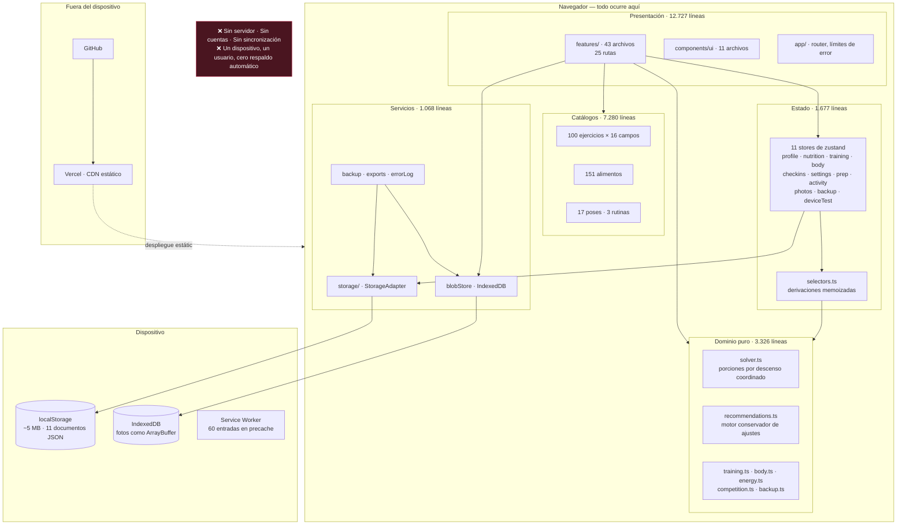
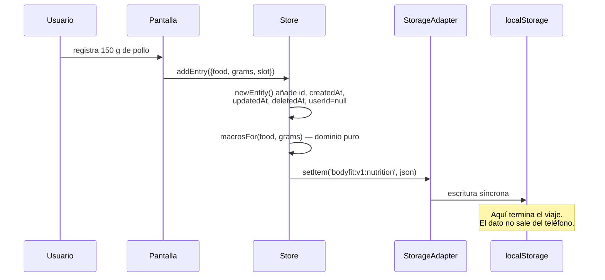
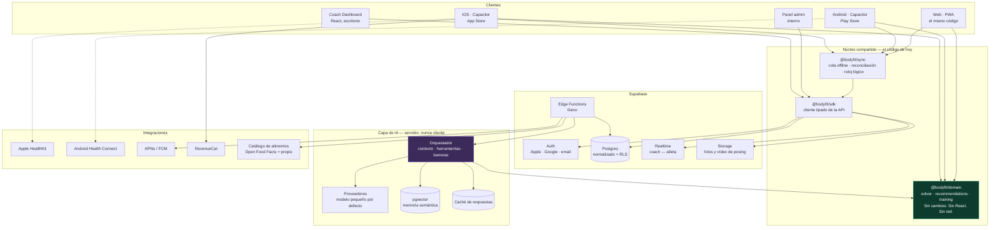
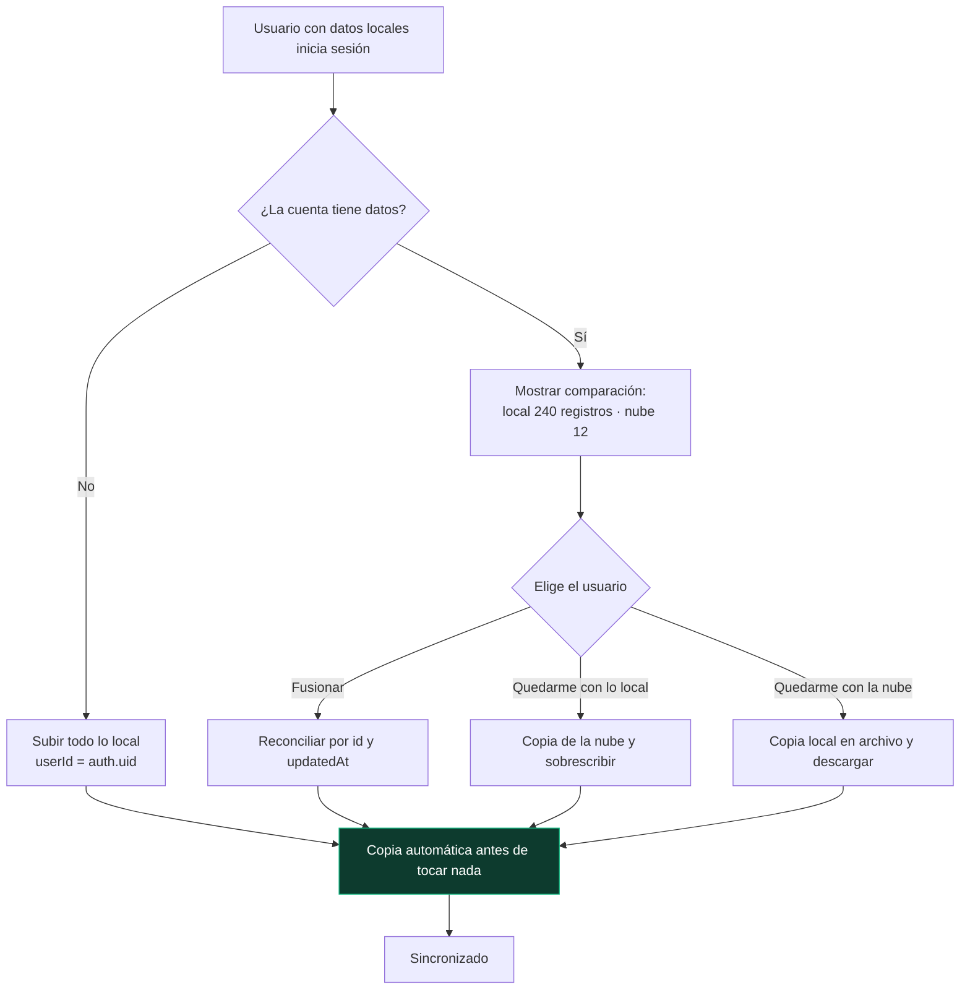
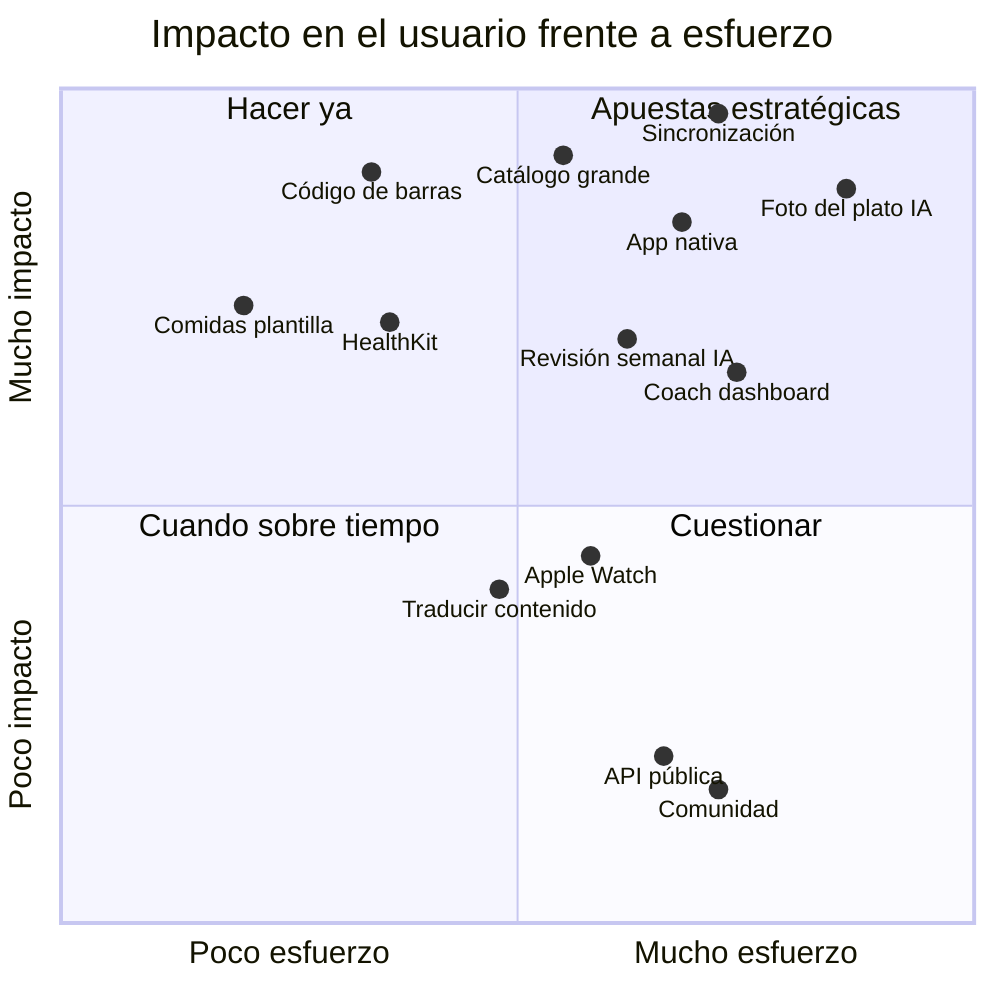
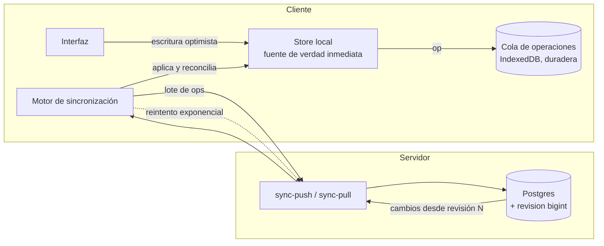
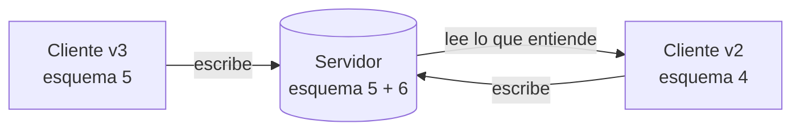
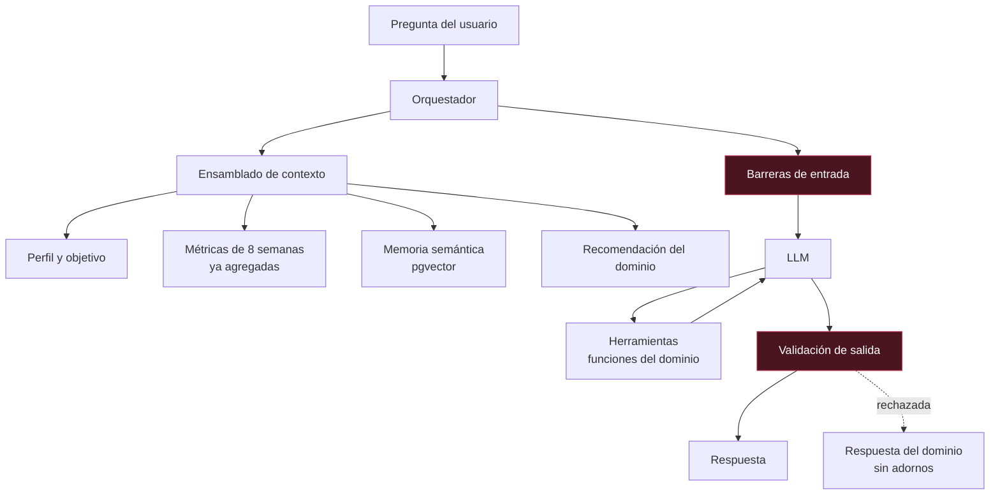
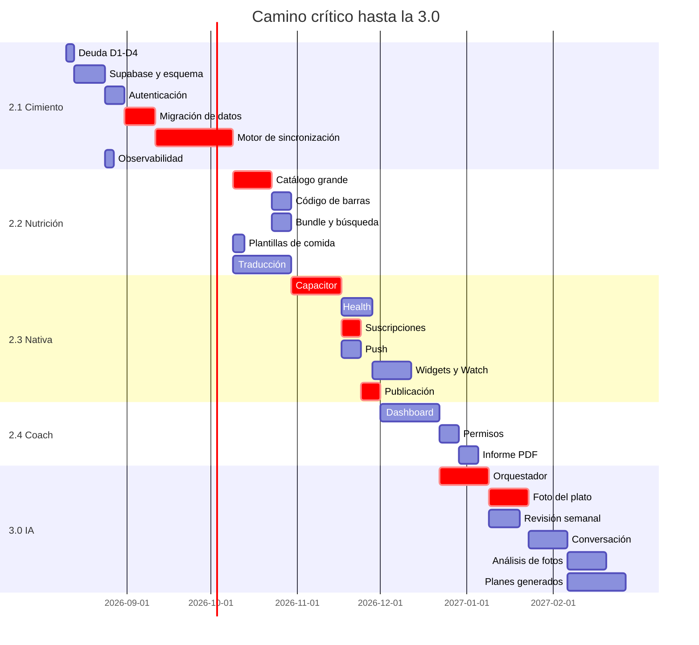

# BodyFit Prep 2.0 — Plan maestro

> Documento vivo. Es la guía oficial del proyecto: cuando el código y este
> documento no coincidan, uno de los dos está mal y hay que decidir cuál.
>
> **Estado:** propuesta técnica, sin implementar.
> **Última revisión:** agosto de 2026, sobre el commit `5c06a59`.
> **Audiencia:** quien tome decisiones técnicas y de producto sobre BodyFit Prep.

---

## Índice

1. [Fase 1 · Análisis de la arquitectura actual](#fase-1--análisis-de-la-arquitectura-actual)
2. [Fase 2 · Arquitectura definitiva](#fase-2--arquitectura-definitiva)
3. [Fase 3 · Versiones](#fase-3--versiones)
4. [Fase 4 · Priorización por impacto](#fase-4--priorización-por-impacto)
5. [Fase 5 · Sistema de sincronización](#fase-5--sistema-de-sincronización)
6. [Fase 6 · Sistema de IA](#fase-6--sistema-de-ia)
7. [Fase 7 · App Store](#fase-7--app-store)
8. [Fase 8 · Monetización](#fase-8--monetización)
9. [Fase 9 · Hoja de ruta](#fase-9--hoja-de-ruta)
10. [Anexos](#anexos)

---

## Resumen ejecutivo

BodyFit Prep es hoy **una aplicación local excelente y un producto comercial
inexistente**. La distancia entre esas dos frases es todo este documento.

Lo que hay es sólido: 29.320 líneas de TypeScript con cinco dependencias de
producción, un dominio puro de 3.326 líneas que se prueba en Node sin
navegador, 170 pruebas end-to-end en dos motores, y un contenido —100 fichas
técnicas escritas a mano, un solver de porciones propio— que ningún competidor
tiene igual.

Lo que falta no son funciones. Es **infraestructura de plataforma**: no hay
cuentas, no hay servidor, no hay sincronización. Todo vive en un teléfono. El
sistema de copias de seguridad que construimos existe para tapar ese agujero, y
el usuario lo nota: le estamos pidiendo que administre sus propios datos.

La tesis de la 2.0 es esta:

> **El activo diferencial es el contenido y el dominio. La infraestructura es
> commodity y hay que comprarla, no construirla.**

Por eso el plan se apoya en Supabase para todo lo que no diferencia (auth,
Postgres, storage, realtime, funciones) y concentra el esfuerzo propio en lo
que sí: el motor de decisiones de prep, el solver de nutrición, y una capa de
IA que un competidor genérico no puede replicar sin el dominio.

**Objetivo de la 3.0:** una plataforma con la que un preparador pueda llevar a
treinta atletas, con app nativa en la App Store, sincronización real y una capa
de IA que interprete progreso en vez de aplicar reglas.

---

# FASE 1 · Análisis de la arquitectura actual

## 1.1 Diagrama de la arquitectura actual



### Flujo de un dato, de principio a fin



## 1.2 Fortalezas

Son reales y hay que protegerlas en la migración, no sacrificarlas por velocidad.

**El dominio es puro y comprobable.** 3.326 líneas sin React, sin
`localStorage`, sin `window`. Se empaquetan con esbuild y se ejecutan en Node.
Es la razón por la que las pruebas de dominio tardan segundos y por la que
mover la lógica a un servidor será mecánico: `solver.ts` y
`recommendations.ts` funcionarán igual en una Edge Function que en el
navegador, sin tocar una línea.

**Un único punto de intercambio de persistencia.** Todos los stores hablan con
`StorageAdapter` (cuatro métodos). Ninguna pantalla toca `localStorage`. Ya
existe `supabaseAdapter.ts` documentado con el esquema SQL, las políticas RLS
y los pasos exactos. Migrar es cambiar una línea en `services/storage/index.ts`.

**El modelo de datos ya está preparado para sincronizar.** Cada entidad tiene
`id`, `createdAt`, `updatedAt`, `deletedAt` y `userId`. Los borrados son
lógicos. Eso es exactamente lo que necesita un last-write-wins, y no hay que
migrar nada para empezar.

**Cinco dependencias de producción.** React, React DOM, React Router, zustand y
los iconos. Las gráficas, el solver, el codificador PNG de los iconos y el
motor de búsqueda son propios. La superficie de ataque de la cadena de
suministro es mínima y no hay ninguna librería que pueda abandonarse y
bloquear el proyecto.

**Las pruebas encuentran fallos de verdad.** No son decorativas: descubrieron
que WebKit no puede guardar `Blob` en IndexedDB (habría perdido todas las
fotos en iPhone), que las migraciones estaban escritas pero nunca conectadas,
que el peso objetivo no se podía borrar, y que tras borrar los datos no había
forma de llegar a la pantalla de restaurar.

**El contenido es el foso.** 100 fichas de técnica escritas una a una con 16
campos, auditadas contra frases de plantilla, lenguaje médico y
contradicciones. Un competidor puede copiar el solver en una semana; ese
contenido son meses.

## 1.3 Debilidades

**No hay servidor.** No es una debilidad más: es *la* debilidad. De ella salen
la ausencia de cuentas, de sincronización, de dashboard de coach, de IA, de
API y de cualquier modelo de negocio recurrente.

**Todo el catálogo viaja en el chunk de entrada.** Medido: `index-*.js` pesa
**396 KB sin comprimir, 116 KB con gzip**, y dentro van los 100 ejercicios con
sus 16 campos de técnica, los 151 alimentos, las poses y los dos diccionarios
completos. Un usuario que solo registra comidas descarga las 100 fichas
técnicas en el primer arranque. Con 50.000 alimentos este modelo no se degrada:
revienta.

**El buscador de alimentos es lineal en memoria.** Funciona con 151 elementos.
Con 50.000 hay que mover la búsqueda al servidor o a un índice invertido
local, y eso cambia el contrato de `foodSearch.ts`.

**Un solo dispositivo, sin recuperación automática.** Si el teléfono se pierde
y no hay copia manual, se perdió el prep entero. Safari además puede desalojar
los datos de un sitio poco usado.

**La i18n cubre la interfaz pero no el contenido.** 1.068 claves con paridad
total en español e inglés, pero los 100 ejercicios, los 151 alimentos y las
poses siguen solo en español. Un usuario anglófono ve media aplicación
traducida.

**No hay observabilidad.** El registro de errores es local y solo se ve si el
usuario descarga el diagnóstico. No sabemos cuántos usuarios hay, qué pantalla
falla, ni dónde abandonan.

## 1.4 Deuda técnica

Medida, no estimada. Ordenada por lo que costará arreglarla más tarde.

| # | Deuda | Dónde | Impacto si no se arregla |
|---|---|---|---|
| D1 | `COLLECTIONS` declara **6** colecciones; existen **10** stores persistidos. Nadie usa la constante. | `services/storage/types.ts` | El día que la sincronización itere `COLLECTIONS` perderá cuatro colecciones en silencio. Es un fallo de pérdida de datos esperando su turno. |
| D2 | Dos esquemas de versión conviven: `STORE_VERSION = 2` para stores con migraciones, `version: 1` para el resto. | `store/persist.ts` | Al añadir la primera migración a un store "de los otros" saltará de 1 a 2 y ejecutará migraciones que no le corresponden. |
| D3 | `SCHEMA_VERSION = 1` exportada y sin usar, junto al `format: 2` del respaldo y al `STORE_VERSION = 2`. Tres numeraciones. | `storage/types.ts`, `domain/backup.ts`, `persist.ts` | Confusión garantizada en la primera migración seria. Hay que unificar en una sola fuente. |
| D4 | `userId` existe en todas las entidades y **nadie lo escribe nunca**: siempre `null`. | `store/persist.ts` | Es intencional y correcto hoy, pero hay que rellenarlo en la migración a cuentas o el RLS rechazará las filas. |
| D5 | El catálogo entero en el chunk de entrada. | `data/*` + configuración de Vite | Bloquea el crecimiento del contenido. |
| D6 | Sin índice de búsqueda persistente: se reconstruye en memoria en cada arranque. | `data/foodSearch.ts` | Arranque más lento conforme crezca el catálogo. |
| D7 | Fotos comprimidas a 1280 px sin política de cuota más allá del aviso al 80%. | `services/blobStore.ts` | Un prep de 20 semanas con 4 ángulos semanales son ~80 fotos; suficiente hoy, insuficiente con vídeo de posing. |
| D8 | No hay capa de red: ni cliente HTTP, ni reintentos, ni cola de operaciones. | — | Todo el trabajo de la 2.1 depende de construirla bien a la primera. |

## 1.5 Riesgos

| Riesgo | Prob. | Impacto | Mitigación |
|---|---|---|---|
| **Pérdida de datos del usuario** por desalojo de Safari o pérdida del teléfono | Media | Crítico | Es la razón número uno para priorizar la sincronización sobre todo lo demás. Hasta que exista: mantener el recordatorio de copia y la restauración desde el onboarding. |
| **Migración a cuentas con pérdida de datos locales** | Media | Crítico | La 2.1 debe *importar* el estado local a la nube en el primer inicio de sesión, nunca reemplazarlo. Prueba E2E obligatoria antes de publicar. |
| **Coste descontrolado de la IA** | Alta | Alto | Presupuesto por usuario y mes, caché agresiva, modelos pequeños por defecto. Ver [Fase 6](#66-coste-y-control-de-gasto). |
| **Responsabilidad sanitaria**: la app da consejos sobre alimentación y entrenamiento a competidores | Media | Crítico | Barreras duras en el prompt del sistema y validación de salida. La IA nunca prescribe fármacos, deshidratación ni restricción agresiva. Es un requisito de arquitectura, no una advertencia legal. |
| **Rechazo en la App Store** por la guía 1.4.1 (salud) o 5.1.1 (privacidad) | Media | Alto | Revisión médica firmada del contenido, política de privacidad, y no pedir datos que no se usan. |
| **Dependencia de un proveedor** (Supabase) | Baja | Medio | Es Postgres estándar con RLS. La salida existe: `pg_dump` y un servidor propio. No usar funciones exclusivas que no tengan equivalente. |
| **El contenido en español limita el mercado** | Alta | Alto | Traducir los catálogos es un proyecto de contenido de varias semanas. Decidir pronto si el mercado inicial es hispanohablante. |

## 1.6 Oportunidades

**El nicho está libre.** MyFitnessPal es nutrición sin entrenamiento. Strong es
entrenamiento sin nutrición. MacroFactor es nutrición adaptativa excelente sin
preparación para competir. RP Hypertrophy es entrenamiento con programación
sin nutrición diaria. **Nadie cubre un prep completo de bodybuilding**, y ese
usuario paga: ya paga 100–300 USD al mes por un preparador.

**El dominio ya construido es la barrera de entrada a la IA.** Un LLM genérico
puede escribir sobre entrenamiento; no puede leer la tendencia de 7 días de
*este* usuario, cruzarla con su adherencia y su sueño y proponer un ajuste
acotado a ±150 kcal. Esa capa ya existe y funciona: la IA se apoya en ella en
vez de sustituirla.

**El coach como multiplicador comercial.** Un preparador con 30 atletas es una
venta que trae 30 usuarios. Es el canal de adquisición más barato del sector.

---

# FASE 2 · Arquitectura definitiva

## 2.1 Visión general



**Principio rector:** el dominio de hoy no se reescribe. Se extrae a un paquete
compartido y se ejecuta en los tres sitios: cliente, Edge Function y dashboard.
Es lo que garantiza que el cálculo de macros del servidor y el del teléfono
nunca discrepen.

## 2.2 Frontend

```
apps/
  mobile/          Capacitor + React — iOS y Android desde el código actual
  web/             PWA, la misma base, sin plugins nativos
  coach/           Dashboard de escritorio, denso, con tablas
  admin/           Panel interno
packages/
  domain/          El dominio actual, intacto
  sync/            Cola offline y reconciliación
  sdk/             Cliente tipado generado desde el esquema
  ui/              Componentes compartidos
  i18n/            Diccionarios y catálogos traducidos
```

**Por qué Capacitor y no React Native.** Reescribir 12.727 líneas de interfaz
para ganar animaciones nativas no es un intercambio razonable. Capacitor da lo
que de verdad falta —HealthKit, notificaciones fiables, widgets, App Store— sin
tirar el trabajo hecho. Si en la 4.0 la fluidez se vuelve el cuello de botella,
se reescribe solo la sesión activa como pantalla nativa.

**Decisiones firmes de frontend**

| Decisión | Motivo |
|---|---|
| Los catálogos salen del bundle y pasan a chunks bajo demanda | Elimina D5. El arranque baja de 116 KB gz a ~45 KB. |
| Búsqueda de alimentos contra el servidor con caché local de los 500 más usados | Un catálogo grande no cabe ni debe caber en el cliente. |
| El dominio nunca importa nada de `services/` | Es lo que permite ejecutarlo en Deno. |
| TanStack Query para el estado del servidor; zustand solo para el local | Son dos problemas distintos y hoy están mezclados. |

## 2.3 Backend y Supabase

### Esquema: de documentos a tablas

El adaptador documentado hoy propone `app_state(user_id, collection, payload)`.
**Sirve para migrar en una tarde y no sirve para una plataforma.** Con
documentos JSON por colección no hay consultas por atleta, ni agregados, ni
dashboard de coach, ni índices. La 2.1 nace ya normalizada.

```sql
-- Identidad
users                 -- gestionado por Supabase Auth
profiles              -- 1:1 con users. Perfil, objetivos, unidades, idioma
subscriptions         -- estado de pago, sincronizado desde RevenueCat

-- Núcleo del atleta
workouts              -- id, user_id, date, name, routine_id, started_at, finished_at
workout_exercises     -- workout_id, exercise_id, order, rep_range, rest_seconds
workout_sets          -- workout_exercise_id, weight_kg, reps, rir, type, done
food_entries          -- user_id, date, slot, food_id, grams, macros (jsonb)
body_measurements     -- user_id, date, weight_kg, waist_cm, ...
daily_readiness       -- user_id, date, weight_kg, sleep, energy, hunger, stress
weekly_checkins       -- user_id, week_start, métricas, adherencia, notas

-- Competencia
preps                 -- show_name, federation, division, show_date, target_weight
prep_recommendations  -- semana, acción, deltas, aceptada o rechazada
cardio_sessions · posing_sessions · progress_photos

-- Catálogos compartidos (no por usuario)
exercises             -- + exercise_techniques, i18n en tabla aparte
foods                 -- + food_translations, food_barcodes
routines              -- de fábrica y de usuario

-- Plataforma
coach_athletes        -- relación coach ↔ atleta, permisos, estado de invitación
ai_conversations · ai_messages · ai_usage
sync_log              -- operaciones aplicadas, para depurar conflictos
audit_log             -- quién vio o cambió qué; obligatorio con datos de salud
```

**Reglas no negociables del esquema**

1. Toda tabla de usuario lleva `user_id uuid not null` y RLS activo. Sin excepciones.
2. Toda tabla lleva `created_at`, `updated_at`, `deleted_at` y `revision bigint`.
3. Los pesos se guardan **siempre en kilogramos** y las longitudes en centímetros. La unidad es una preferencia de presentación. Esta regla ya existe en el cliente y sube al servidor sin cambios.
4. Nada de `payload jsonb` para datos consultables. `jsonb` solo para macros calculados y notas.

### Row Level Security

```sql
-- El atleta ve lo suyo
create policy "propio" on workouts
  for all using (auth.uid() = user_id);

-- El coach ve lo de sus atletas con relación aceptada
create policy "coach lee" on workouts
  for select using (exists (
    select 1 from coach_athletes ca
    where ca.athlete_id = workouts.user_id
      and ca.coach_id  = auth.uid()
      and ca.status    = 'accepted'
  ));
```

**El coach lee, no escribe.** Puede comentar y proponer; los datos del atleta
solo los cambia el atleta. Es una decisión de producto con forma de política SQL.

### Edge Functions

| Función | Qué hace | Por qué en el servidor |
|---|---|---|
| `ai-chat` | Orquesta el LLM | La clave de API jamás toca el cliente |
| `ai-photo-meal` | Foto del plato → alimentos y cantidades | Modelo de visión, coste controlado |
| `ai-weekly-review` | Interpreta la semana | Se ejecuta programada, no bajo demanda |
| `sync-push` / `sync-pull` | Reconciliación por lotes | Ver [Fase 5](#fase-5--sistema-de-sincronización) |
| `barcode-lookup` | Código de barras → alimento | Proxy con caché a Open Food Facts |
| `coach-digest` | Resumen semanal al coach | Programada |
| `revenuecat-webhook` | Estado de suscripción | Firma verificada |
| `export-pdf` | Informe con gráficas y fotos | Necesita renderizado |

## 2.4 Autenticación

**Sign in with Apple obligatorio** si hay cualquier otro proveedor social: es
la guía 4.8 de la App Store y no es negociable. Además Google y email con
enlace mágico.

El punto delicado no es entrar, es **el primer inicio de sesión de un usuario
que ya tiene datos locales**:



**Nunca se borra sin copia previa.** El sistema de respaldo ya construido se
reutiliza aquí: antes de cualquier fusión se genera el archivo completo.

## 2.5 Storage

| Contenido | Dónde | Política |
|---|---|---|
| Fotos de progreso | Supabase Storage, bucket privado | URL firmada de 60 s. Original + miniatura. Cifrado en reposo. |
| Vídeo de posing | Storage, bucket privado | Máximo 60 s, transcodificado. Solo en planes de pago. |
| Informes PDF | Storage, temporal | Caducan a los 7 días. |
| Copias de seguridad | El dispositivo del usuario | **No se suben.** Sigue siendo su archivo. |

Las fotos son el dato más sensible de la aplicación. Bucket privado, sin
acceso público jamás, y el coach solo las ve si el atleta le concede permiso
explícito y revocable.

## 2.6 Notificaciones push

Tres categorías, con permiso pedido **cuando aportan valor**, no al arrancar:

1. **Recordatorios propios** — pesarse, registrar comida, check-in. Locales, sin servidor.
2. **Del coach** — mensaje o revisión. Push real vía APNs/FCM.
3. **Del sistema** — resumen semanal listo, análisis terminado.

## 2.7 Apple Health y Health Connect

| Dato | Dirección | Nota |
|---|---|---|
| Pasos | Lectura | Elimina el peor formulario de la app |
| Peso corporal | Lectura y escritura | Báscula Bluetooth sin integrarla nosotros |
| Energía activa | Lectura | Mejora la estimación de gasto |
| Sueño | Lectura | Alimenta el motor de recomendaciones |
| Frecuencia cardíaca | Lectura | Zonas de cardio |
| Entrenamiento | Escritura | La sesión aparece en la app Salud |
| Nutrición | Escritura | Opcional, ruidoso |

**Regla:** Health es una *fuente*, nunca la verdad. Si hay dato manual y dato
de Health para el mismo día, gana el manual y se marca el origen.

## 2.8 API pública

No en la 2.x. Se diseña en la 3.0 cuando haya demanda real.

- REST versionada `/v1`, con OAuth2 y ámbitos por recurso.
- Solo lectura al principio.
- Cuota por plan.
- Casos de uso: integraciones de coaches, Zapier, investigación con consentimiento.

## 2.9 Coach Dashboard

Aplicación de escritorio aparte, no una vista más del móvil. Un coach revisa
treinta atletas el domingo por la mañana: necesita densidad, tablas y
comparación, justo lo contrario que la app del atleta.

- Lista de atletas con semáforo: adherencia, tendencia, días sin registrar.
- Ficha del atleta: gráficas, fotos con permiso, historial de recomendaciones.
- Aprobar o modificar los ajustes que propone el sistema.
- Comentarios por semana.
- Exportación por lotes.

## 2.10 Panel administrativo

Interno. Métricas de producto, gestión del catálogo de alimentos y ejercicios,
revisión de contenido, soporte, moderación de altas de alimentos propios, y
cuadro de gasto de IA por usuario.

---

# FASE 3 · Versiones

## 2.1 — Cuentas y sincronización · *el cimiento*

**Objetivo:** que perder el teléfono deje de ser perder el prep.

- Supabase: proyecto, esquema normalizado, RLS.
- Sign in with Apple, Google y email.
- Migración del estado local a la nube, con copia previa y sin pérdidas.
- Sincronización offline primero, con cola y reconciliación.
- Pago de deuda: D1, D2, D3, D4.
- Observabilidad: Sentry y métricas básicas.

**Se considera terminada cuando** un usuario instala en un segundo dispositivo,
inicia sesión, y ve exactamente lo mismo; y cuando registra sin conexión en el
metro y al salir todo está sincronizado.

## 2.2 — Nutrición de verdad · *el uso diario*

**Objetivo:** que registrar comida deje de ser trabajo.

- Catálogo de decenas de miles de alimentos, con búsqueda en servidor.
- Código de barras.
- Comidas y recetas guardadas como plantilla.
- Catálogos fuera del bundle (D5) y búsqueda con índice (D6).
- Traducción del contenido al inglés.

**Terminada cuando** el tiempo medio de registro de una comida baje de los ~25
segundos actuales a menos de 8, medido de verdad.

## 2.3 — Nativa y conectada · *la App Store*

**Objetivo:** dejar de ser una página web instalable.

- Capacitor, iOS y Android.
- HealthKit y Health Connect.
- Notificaciones push reales.
- Widget de bloqueo, Live Activity para el descanso, app de Apple Watch.
- Suscripción con RevenueCat.
- Publicación en App Store y Play Store.

## 2.4 — El coach · *el modelo de negocio*

**Objetivo:** convertir a un preparador en canal de distribución.

- Dashboard de coach.
- Invitaciones, permisos y revocación.
- Aprobación de recomendaciones.
- Informe PDF con gráficas y fotos.
- Facturación por atleta.

## 3.0 — Inteligencia · *el diferencial*

**Objetivo:** dejar de aplicar reglas y empezar a interpretar.

- Orquestador de IA con herramientas sobre el dominio.
- Foto del plato → alimentos y cantidades.
- Revisión semanal interpretada.
- Conversación con memoria del historial.
- Análisis de fotos de progreso.
- Planes de entrenamiento generados y ajustados a la adherencia real.

## 3.1+ — Plataforma

API pública, equipos y federaciones, marketplace de programas, comunidad.

---

# FASE 4 · Priorización por impacto

No por facilidad. La pregunta es: **si esto no existe, ¿el usuario se va?**



**Los cinco que deciden si el producto existe**

| # | Qué | Por qué es de vida o muerte |
|---|---|---|
| 1 | **Sincronización con cuenta** | Sin esto no hay producto de pago. Nadie confía meses de prep a un solo teléfono. Además bloquea coach, IA, dashboard y multi-dispositivo. |
| 2 | **Catálogo de alimentos grande + código de barras** | 151 alimentos no aguantan una semana de uso real. Es la causa número uno de abandono en apps de nutrición. |
| 3 | **App nativa en la App Store** | "Compartir → Añadir a pantalla de inicio" pierde a la mayoría de la gente, y sin nativo no hay HealthKit, ni push fiable, ni widgets. |
| 4 | **Foto del plato con IA** | Lo único que convierte el registro de 25 segundos en 3. Es la función que se enseña en una demo y vende la suscripción. |
| 5 | **Coach dashboard** | Es el multiplicador comercial: una venta trae treinta usuarios. |

**Lo que parece urgente y no lo es:** Apple Watch (impacto real menor del que
sugiere el entusiasmo), API pública (nadie la ha pedido), comunidad (cuesta
moderación y no retiene en este nicho), rediseño visual (la interfaz actual
está por encima de la media del sector).

---

# FASE 5 · Sistema de sincronización

Es la pieza más delicada del plan. Si falla, se pierden datos, y en una app de
prep eso significa perder meses de trabajo de una persona.

## 5.1 Principios

1. **Offline primero, sin excepciones.** La app funciona entera sin red. La red es una mejora, nunca un requisito.
2. **El cliente nunca espera al servidor** para confirmar una escritura local.
3. **Nada se borra de verdad.** Borrado lógico siempre, para que un borrado pueda propagarse y también revertirse.
4. **Ante la duda, conservar.** Si el conflicto no se puede resolver con certeza, se guardan las dos versiones y decide la persona.

## 5.2 Arquitectura



## 5.3 Modelo de operaciones

No se sincroniza *estado*: se sincronizan **operaciones**. Enviar el documento
entero de nutrición provoca que dos dispositivos se pisen colecciones enteras.

```ts
interface SyncOp {
  opId: string;            // uuid, idempotencia
  entity: EntityKind;      // 'workout' | 'food_entry' | ...
  entityId: string;
  kind: 'create' | 'update' | 'delete';
  patch: Record<string, unknown>;   // solo los campos tocados
  clientClock: HybridClock;
  deviceId: string;
  createdAt: string;
}
```

**Idempotencia por `opId`.** El servidor guarda los identificadores aplicados;
reenviar una operación no la duplica. Es lo que hace seguro el reintento
agresivo.

## 5.4 Reloj y orden

`updatedAt` con la hora del dispositivo no basta: los relojes de los teléfonos
mienten, y un teléfono con la fecha adelantada gana todos los conflictos para
siempre.

**Reloj lógico híbrido (HLC):** `(tiempo_físico, contador, deviceId)`. Ordena
de forma total, tolera desajustes y no depende de que los relojes coincidan.

## 5.5 Resolución de conflictos

Por tipo de entidad, no una regla global:

| Entidad | Estrategia | Motivo |
|---|---|---|
| `workout_sets` | LWW por campo | Dos dispositivos rara vez editan la misma serie; a nivel de campo casi nunca hay choque real. |
| `food_entries` | Sin conflicto: son inserciones | Cada registro es un hecho nuevo. Solo el borrado compite, y gana el borrado. |
| `profile`, `settings` | LWW por campo | Cambiar unidades en un sitio y el objetivo en otro debe conservar ambos. |
| `weekly_checkins` | LWW por documento, con aviso | Es una unidad conceptual; partirla no tiene sentido. |
| `preps` | LWW con confirmación | Cambiar la fecha del show mueve todo el calendario. Merece preguntar. |
| Fotos | Sin conflicto | El binario es inmutable; solo compiten los metadatos. |

**Conflicto irresoluble → se conserva.** Se crea una versión duplicada marcada
y se avisa. Perder el dato jamás es la opción por defecto.

## 5.6 Historial y versionado

```sql
create table entity_revisions (
  entity_kind text not null,
  entity_id   uuid not null,
  revision    bigint not null,
  patch       jsonb not null,
  device_id   text,
  created_at  timestamptz not null default now(),
  primary key (entity_kind, entity_id, revision)
);
```

Permite tres cosas que hoy no existen: deshacer, auditar quién cambió qué
(obligatorio con datos de salud compartidos con un coach), y depurar
conflictos con evidencia en vez de con suposiciones.

Retención: 90 días para las revisiones finas; los datos actuales, para siempre.

## 5.7 Migraciones en un mundo sincronizado

Es el problema que más silenciosamente rompe las aplicaciones sincronizadas:
**el cliente viejo y el nuevo conviven durante semanas**.



**Reglas**

1. El servidor entiende **N y N−1** siempre. Nunca se rompe la compatibilidad hacia atrás en un solo despliegue.
2. Las migraciones **solo añaden**: columna nueva con valor por defecto. Renombrar es añadir, copiar, y borrar tres versiones después.
3. Todo cambio de esquema va acompañado de su prueba de "cliente viejo contra servidor nuevo".
4. Un número de esquema único —hoy hay tres, ver D3—, propagado a cliente y servidor desde una sola definición.
5. Versión mínima soportada: por debajo, la app pide actualizar en vez de corromper.

## 5.8 Comportamiento visible

El usuario debe entender el estado sin aprender nada:

| Estado | Qué ve |
|---|---|
| Sincronizado | Nada. El silencio es la señal. |
| Pendiente | Punto discreto junto a la fecha |
| Sin conexión | Aviso en la barra, con recuento de cambios pendientes |
| Conflicto | Tarjeta con las dos versiones y qué eligió la app |
| Error persistente | Aviso y acceso al diagnóstico existente |

---

# FASE 6 · Sistema de IA

## 6.1 Postura

**La IA no sustituye al dominio: lo usa como herramienta.** El motor de
recomendaciones actual está bien construido y es conservador a propósito. El
LLM no recalcula calorías: llama a la función que ya existe, recibe el
resultado acotado y lo *explica* en el contexto de las últimas ocho semanas.

Esto tiene tres ventajas que no son negociables: los números siguen siendo
deterministas y auditables, el modelo no puede inventar un déficit de 800 kcal,
y el coste baja porque el modelo razona sobre poco texto en vez de calcular.



## 6.2 Contexto

Nunca se envía la base de datos. Se envía un resumen calculado en el servidor,
con presupuesto de tokens fijo:

| Bloque | Tokens | Contenido |
|---|---|---|
| Sistema | ~800 | Rol, límites, tono, prohibiciones |
| Perfil | ~150 | Sexo, edad, altura, objetivo, semanas al show |
| Estado actual | ~300 | Media de 7 días, tendencia, adherencia, macros |
| Serie temporal | ~600 | 8 semanas agregadas, no día a día |
| Entrenamiento | ~400 | Volumen por músculo, estancamientos detectados |
| Memoria | ~500 | Fragmentos relevantes recuperados |
| Conversación | ~1.000 | Últimos turnos |
| **Total** | **~3.750** | Coste predecible |

## 6.3 Memoria

Tres capas con propósitos distintos:

1. **Corto plazo** — la conversación, en Postgres. Se resume al superar 20 turnos.
2. **Semántica** — hechos duraderos en `pgvector`: "no tolera la lactosa", "el peso muerto le da molestias lumbares", "trabaja en turnos de noche". Se extraen automáticamente y **el usuario puede verlos y borrarlos**.
3. **Estructurada** — la base de datos misma. La IA la consulta con herramientas, no la memoriza.

## 6.4 Herramientas

El modelo no calcula: llama.

```ts
getWeightTrend(weeks)          // domain/body
getAdherence(from, to)
getVolumeByMuscle(weeks)       // domain/training
getRecommendation()            // domain/recommendations — acotada por diseño
searchFood(query)
getExerciseTechnique(id)       // las 100 fichas escritas a mano
getLastSession(exerciseId)     // domain/training
proposeAdjustment(kcal, cardio) // NO aplica: propone y el usuario decide
```

`proposeAdjustment` nunca escribe. La IA propone, la persona acepta. Esa
frontera es de arquitectura.

## 6.5 Seguridad

Es una aplicación de salud usada por competidores. Las barreras son parte del
diseño, no una advertencia legal al pie.

**Prohibiciones absolutas, verificadas en la salida:**

- Nada de fármacos, hormonas, diuréticos ni sustancias mejoradoras.
- Nada de protocolos de deshidratación ni manipulación agresiva de agua o sodio.
- Nada de déficits fuera de los límites del dominio (±150 kcal, ±60 min de cardio).
- Nada de diagnósticos ni de interpretación de síntomas.
- Ante cualquier señal de trastorno de conducta alimentaria: parar, no aconsejar y derivar a un profesional.

```
Entrada → detección de inyección de prompt → clasificador de tema
        → LLM → validador de salida → registro → respuesta
                      ↓ falla
              respuesta del dominio, sin adornos
```

El validador es determinista, no otro LLM: expresiones regulares sobre
sustancias, comprobación numérica de que los ajustes están dentro de los
límites del dominio, y detección de lenguaje clínico.

## 6.6 Coste y control de gasto

El riesgo real no es técnico: es que la factura crezca más rápido que los
ingresos.

| Operación | Modelo | Tokens | Coste aprox. | Frecuencia |
|---|---|---|---|---|
| Pregunta simple | pequeño | 4k in / 500 out | ~0,002 USD | alta |
| Revisión semanal | mediano | 6k / 1,5k | ~0,03 USD | 1/semana |
| Foto del plato | visión | 1 img + 1k | ~0,01 USD | 3–5/día |
| Análisis de fotos | visión | 2 img + 2k | ~0,04 USD | 1/mes |
| Plan de entrenamiento | grande | 8k / 3k | ~0,15 USD | rara |

**Estimación por usuario activo y mes:** 1,20–2,50 USD. Con una suscripción de
9,99 USD deja margen, **siempre que haya control**:

1. Presupuesto por usuario y mes, con degradación elegante al agotarse.
2. Modelo pequeño por defecto; escalar solo cuando la tarea lo exija.
3. Caché semántica: preguntas parecidas reutilizan respuesta.
4. Caché de prompt del sistema entre llamadas.
5. Las funciones caras (foto del plato) solo en planes de pago.
6. Cuadro de gasto por usuario en el panel administrativo, con alerta.

## 6.7 Privacidad

| Dato | Regla |
|---|---|
| Fotos de progreso | **Nunca** a un tercero sin consentimiento explícito y revocable, pedido cada vez. |
| Peso, medidas, salud | Anonimizados en el prompt: "atleta de 32 años" y no un nombre. |
| Conversaciones | Del usuario. Exportables y borrables. |
| Entrenamiento del proveedor | Desactivado por contrato. Sin excepciones. |
| Retención | 90 días, o hasta que el usuario borre. |

Toda función de IA es **opcional y desactivable**. La app entera funciona sin
ella, igual que hoy.

## 6.8 Casos de uso

| Caso | Entrada | Cómo | Valor |
|---|---|---|---|
| **Foto del plato** | Imagen | Visión → alimentos y gramos → el usuario corrige | El mayor ahorro de tiempo de toda la app |
| **Revisión semanal** | Datos de la semana | Herramientas del dominio + interpretación | Convierte números en una decisión |
| **Explicar un estancamiento** | 4 semanas planas | Cruza peso, adherencia, sueño, volumen | Es lo que hace un coach y las reglas no ven |
| **Preguntas abiertas** | "¿Puedo cambiar sentadilla por prensa?" | Consulta las fichas técnicas propias | Respuesta con el contenido de la casa |
| **Interpretar comida escrita** | "dos tacos de asada" | Sin catálogo, con estimación y margen | Cubre el hueco que ningún catálogo cubre |
| **Generar un plan** | Objetivo y disponibilidad | Genera, valida contra el dominio, el usuario acepta | Cierra el hueco frente a RP Hypertrophy |

---

# FASE 7 · App Store

## 7.1 Qué hay que cambiar

| Ahora | Después | Motivo |
|---|---|---|
| PWA instalable desde Safari | Capacitor, binario firmado | Sin nativo no hay HealthKit, push ni widgets |
| Sin cuentas | Auth con Sign in with Apple | Guía 4.8, obligatorio |
| Sin pagos | RevenueCat + StoreKit 2 | Guía 3.1.1: el contenido digital se paga dentro de la app |
| Aviso de salud en tres sitios | Uno, en el onboarding, aceptado | Guía 1.4.1 |
| Sin política de privacidad | Publicada y enlazada | Guía 5.1.1, y la ficha de privacidad |
| Solo oscuro | Modo claro y Dynamic Type | Rechazo por accesibilidad y reseñas malas |
| Contenido en español | Bilingüe completo | Reseñas de una estrella garantizadas |

## 7.2 Qué hay que eliminar

- Diagnóstico y prueba de iPhone (ya están detrás del modo desarrollador; en el binario no deben compilarse siquiera).
- Configuración de vídeos: pedir al usuario que aloje sus MP4 es una pantalla de administrador.
- Cualquier texto que suene a consejo médico.
- El IMC.

## 7.3 Qué hay que añadir

**Obligatorio para publicar**

- Ficha de privacidad completa y honesta.
- Cuenta borrable desde dentro de la app (guía 5.1.1(v)), con borrado real en el servidor.
- Restauración de compras.
- Contacto de soporte.
- Revisión del contenido por un profesional identificable.

**Para no fracasar tras publicar**

- Onboarding con prueba gratuita clara.
- Capturas y vídeo de la App Store centrados en la foto del plato y en el prep.
- Localización de la ficha.
- Widgets y Live Activity: aparecen en las búsquedas y en la prensa.

## 7.4 Riesgos de revisión

| Motivo probable | Prevención |
|---|---|
| 1.4.1 — la app da consejos de salud | Avisos claros, sin diagnóstico, contenido revisado |
| 2.1 — "es una web envuelta" | Widgets, Health, push y háptica: valor nativo demostrable |
| 3.1.1 — pago fuera de la app | Todo por StoreKit |
| 5.1.1 — datos sin justificar | Pedir solo lo que se usa, cuando se usa |
| 4.8 — falta Sign in with Apple | Implementado desde el primer día |

---

# FASE 8 · Monetización

## 8.1 El mercado

| Producto | Precio | Qué le falta |
|---|---|---|
| MyFitnessPal | 19,99 USD/mes | Entrenamiento serio, prep |
| MacroFactor | 11,99 USD/mes | Entrenamiento, competencia |
| Strong | 9,99 USD/mes | Nutrición |
| RP Hypertrophy | 34,99 USD/mes | Nutrición diaria |
| **Preparador humano** | **100–300 USD/mes** | Es el competidor real |

El competidor no es una app: es el coach. Y el objetivo no es sustituirlo —es
hacerlo más eficiente, para que pueda llevar treinta atletas en vez de diez.

## 8.2 Modelos

### A · Suscripción al atleta — el cimiento

| Plan | Precio | Contenido |
|---|---|---|
| **Gratis** | 0 | Registro completo, catálogo, técnica, 1 dispositivo, sin sincronización |
| **Pro** | 9,99/mes · 79,99/año | Sincronización, código de barras, Health, informes, widgets |
| **Prep** | 19,99/mes · 159,99/año | Todo lo anterior + módulo de competencia + IA completa + foto del plato |

Lo gratuito debe ser **genuinamente útil**: es donde vive el contenido que nos
diferencia y lo que hace que alguien recomiende la app. La sincronización es la
línea de pago porque es cara de operar y es lo que más se valora.

### B · Coach — el multiplicador

| Plan | Precio | Atletas |
|---|---|---|
| Coach | 49/mes | hasta 10 |
| Coach Pro | 99/mes | hasta 30 |
| Equipo | 199/mes | hasta 100, marca propia |

El coach paga y **sus atletas obtienen Prep incluido**. Convierte una venta en
treinta usuarios activos. Es el canal con mejor economía del plan.

### C · Licencias

Gimnasios y federaciones, contrato anual, marca propia y panel. Ciclo de venta
largo; no antes de la 3.1.

### D · Lo que **no** hay que hacer

- **Publicidad.** Destruye la confianza en una app de salud y rinde poco en este nicho.
- **Vender datos.** Fin de la conversación.
- **Comisión sobre suplementos.** Contamina el consejo: si la app recomienda algo, no puede ganar dinero con ello.

## 8.3 Proyección

Escenario conservador a 18 meses de la 2.1:

| Métrica | Valor |
|---|---|
| Descargas | 25.000 |
| Activos mensuales | 6.000 (24 %) |
| Conversión a pago | 5 % → 300 |
| Ingreso medio por usuario de pago | 12 USD |
| Coaches | 25 × 70 USD |
| **Ingreso mensual** | **~5.350 USD** |
| Coste IA (300 × 1,80) | −540 |
| Infraestructura | −250 |
| Tiendas (15 %) | −800 |
| **Margen** | **~3.760 USD/mes** |

No es un negocio que sostenga a un equipo. **Sostiene a una persona** y
demuestra el modelo. Escalar exige inversión en adquisición, y el canal de
coaches es el que mejor multiplica.

## 8.4 Métricas que importan

- Retención a 30 días (objetivo > 35 %; el sector ronda el 20 %).
- Días con registro por semana (objetivo > 4).
- Conversión de gratis a pago (objetivo > 4 %).
- Coste de IA por usuario de pago (límite 2,50 USD).
- Atletas por coach (objetivo > 12).

---

# FASE 9 · Hoja de ruta

Estimaciones para **una persona a tiempo completo**. Con más gente, las tareas
sin dependencia se paralelizan.

## 9.1 Tabla maestra

| # | Entrega | Ver. | Impacto | Compl. | Tiempo | Depende de | Riesgo principal |
|---|---|---|---|---|---|---|---|
| 1 | Pagar deuda D1–D4 | 2.1 | Medio | Baja | 3 d | — | Ninguno. Hacerlo antes de tocar la sincronización. |
| 2 | Proyecto Supabase + esquema + RLS | 2.1 | Crítico | Media | 1,5 sem | 1 | Esquema mal diseñado: caro de cambiar después |
| 3 | Auth con Apple, Google, email | 2.1 | Crítico | Media | 1 sem | 2 | — |
| 4 | **Migración de datos locales a la nube** | 2.1 | Crítico | Alta | 1,5 sem | 3 | **Pérdida de datos.** Prueba E2E obligatoria antes de publicar |
| 5 | Motor de sincronización offline | 2.1 | Crítico | **Muy alta** | 4 sem | 4 | Conflictos mal resueltos: pérdida silenciosa |
| 6 | Observabilidad (Sentry, métricas) | 2.1 | Alto | Baja | 3 d | 2 | — |
| 7 | Catálogo grande de alimentos | 2.2 | Crítico | Media | 2 sem | 2 | Calidad y licencia de los datos |
| 8 | Código de barras | 2.2 | Crítico | Media | 1 sem | 7 | Permiso de cámara |
| 9 | Catálogos fuera del bundle (D5, D6) | 2.2 | Alto | Media | 1 sem | 7 | — |
| 10 | Comidas y recetas plantilla | 2.2 | Alto | Baja | 4 d | 2 | — |
| 11 | Traducción del contenido | 2.2 | Medio | Media | 3 sem | — | Es contenido, no código: se puede delegar |
| 12 | Capacitor iOS + Android | 2.3 | Crítico | Alta | 2,5 sem | 5 | Diferencias del ciclo de vida nativo |
| 13 | HealthKit + Health Connect | 2.3 | Alto | Media | 1,5 sem | 12 | Permisos y datos duplicados |
| 14 | Push real | 2.3 | Medio | Media | 1 sem | 12 | — |
| 15 | Suscripciones con RevenueCat | 2.3 | Crítico | Media | 1 sem | 12 | Errores de facturación |
| 16 | Widget + Live Activity + Watch | 2.3 | Medio | Alta | 2 sem | 12 | — |
| 17 | Publicación en las tiendas | 2.3 | Crítico | Media | 1 sem | 12,15 | **Rechazo por 1.4.1 o 5.1.1** |
| 18 | Coach dashboard | 2.4 | Alto | Alta | 3 sem | 5 | — |
| 19 | Invitaciones y permisos | 2.4 | Alto | Media | 1 sem | 18 | Fuga de datos entre atletas: RLS estricta |
| 20 | Informe PDF | 2.4 | Medio | Media | 1 sem | 18 | — |
| 21 | Orquestador de IA + barreras | 3.0 | Alto | Alta | 2,5 sem | 5 | **Consejo inseguro.** El validador es obligatorio |
| 22 | **Foto del plato** | 3.0 | Crítico | Alta | 2 sem | 21,7 | Precisión insuficiente: rechazo del usuario |
| 23 | Revisión semanal interpretada | 3.0 | Alto | Media | 1,5 sem | 21 | — |
| 24 | Conversación con memoria | 3.0 | Medio | Alta | 2 sem | 21 | Coste |
| 25 | Análisis de fotos de progreso | 3.0 | Medio | Alta | 2 sem | 21 | **Privacidad.** Consentimiento explícito |
| 26 | Planes generados | 3.0 | Alto | Muy alta | 3 sem | 21 | Programas malos dañan la reputación |

**Total hasta la 3.0: unas 42 semanas** de una persona. Con dos, unas 26.

## 9.2 Camino crítico



## 9.3 Los tres riesgos que pueden hundir el plan

1. **La sincronización sale mal.** Es la tarea más difícil y de la que todo depende. *Mitigación:* construirla con un solo tipo de entidad (`body_measurements`) de principio a fin, incluidas las pruebas de conflicto, antes de extenderla al resto. Cuatro semanas es la estimación honesta; si en dos no funciona con una entidad, hay que replantear.

2. **La App Store rechaza.** *Mitigación:* preparar el cumplimiento desde la 2.1 —borrado de cuenta, privacidad, avisos— y no como último paso antes de enviar.

3. **La IA cuesta más de lo que ingresa.** *Mitigación:* presupuesto por usuario desde la primera línea de código, no como optimización posterior. Ninguna función cara en el plan gratuito.

## 9.4 Puertas de decisión

Momentos para parar y decidir con datos, no con entusiasmo:

| Tras | Pregunta | Si la respuesta es no |
|---|---|---|
| 2.1 | ¿Sincroniza sin perder un solo dato en 2 semanas de uso real? | No seguir. Arreglarlo. |
| 2.2 | ¿Bajó el tiempo de registro de comida por debajo de 8 s? | Revisar el flujo antes de invertir en nativo |
| 2.3 | ¿Convierte más del 3 % a pago en 60 días? | Revisar precio y qué es gratis antes de construir el dashboard |
| 2.4 | ¿Hay al menos 10 coaches activos? | La IA puede esperar; el canal no funciona |
| 3.0 | ¿La foto del plato acierta por encima del 80 %? | No publicarla. Una función de IA mala hace más daño que su ausencia |

---

# Anexos

## A · Estado medido del proyecto — agosto de 2026

| Métrica | Valor |
|---|---|
| Líneas de TypeScript y TSX | 29.320 |
| Dominio puro | 3.326 líneas · 15 archivos |
| Catálogos | 7.280 líneas · 344 KB en disco |
| Interfaz | 12.727 líneas · 43 pantallas |
| Dependencias de producción | 5 |
| Rutas | 25 |
| Stores persistidos | 11 |
| Ejercicios · alimentos · poses | 100 · 151 · 17 |
| Claves de idioma | 1.068 × 2, paridad total |
| Pruebas E2E | 170 en dos motores · 9 archivos |
| Chunk de entrada | 396 KB · **116 KB con gzip** |
| Lighthouse | 95 / 100 / 100 |

## B · Decisiones de arquitectura ya tomadas y que no se revisan

1. **El dominio no importa nada de infraestructura.** Es lo que permite ejecutarlo en el cliente, en Deno y en pruebas.
2. **Los pesos se guardan en kilogramos.** La unidad es presentación.
3. **Borrado lógico siempre.**
4. **Nada se borra sin copia previa.**
5. **La IA propone, la persona decide.**
6. **Sin publicidad y sin venta de datos.**

## C · Glosario

| Término | Significado |
|---|---|
| **HLC** | Reloj lógico híbrido: ordena eventos entre dispositivos sin fiarse de la hora del teléfono |
| **LWW** | Last-write-wins: gana la escritura más reciente |
| **RLS** | Row Level Security: Postgres decide qué filas ve cada usuario |
| **RIR** | Repeticiones en reserva |
| **Prep** | Preparación para una competición de culturismo |
| **Peak week** | La última semana antes del show |

## D · Cómo se mantiene este documento

- Se revisa al cerrar cada versión.
- Cuando una decisión cambia, se actualiza aquí **antes** de tocar el código.
- Las estimaciones se corrigen con lo que costó de verdad, para que la próxima sea mejor.
- Si el documento y el código discrepan, es un fallo que hay que arreglar en uno de los dos.
