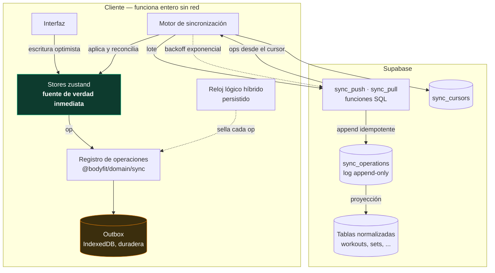
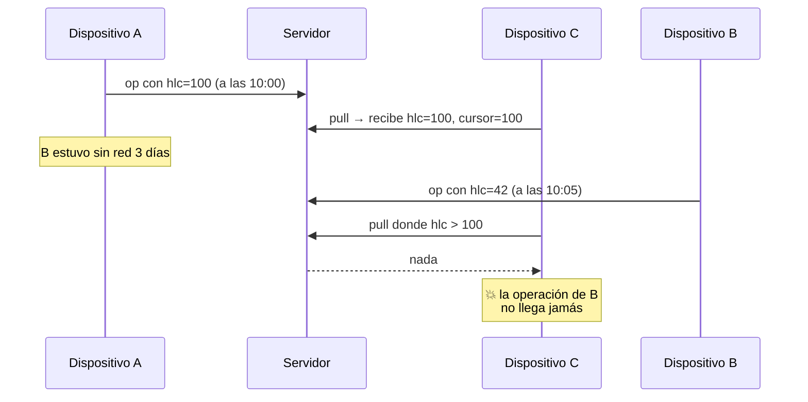
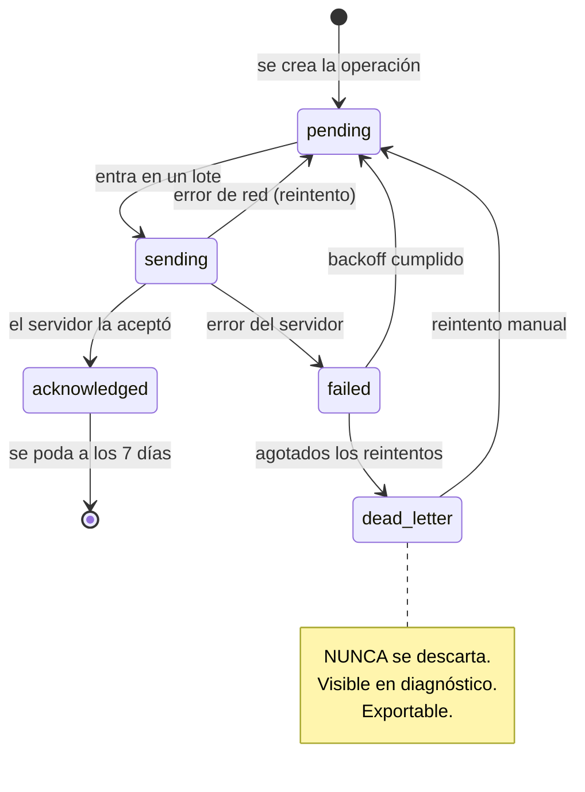
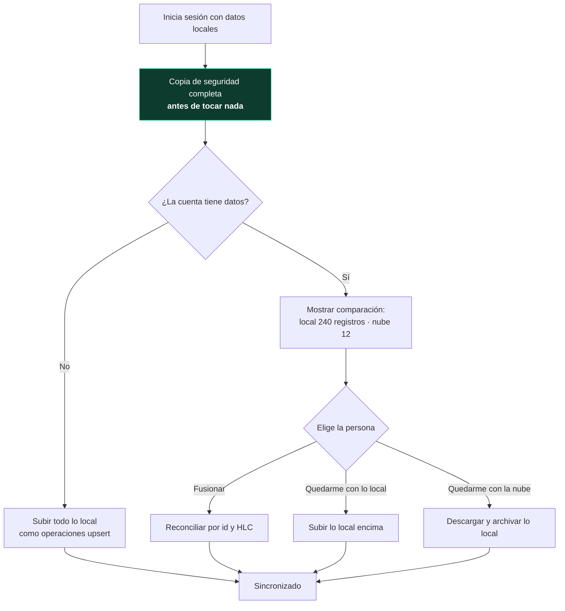

# Motor de sincronización offline-first — plan de implementación

**BodyFit Prep 2.1** · Documento de diseño previo a la implementación
Base: `bodyfit-before-sync-engine` (`95bc92b`)
Consistente con [BODYFIT_V2_MASTER_PLAN.md](BODYFIT_V2_MASTER_PLAN.md) · Fase 5

---

## Índice

1. [Qué se está construyendo y qué no](#1-qué-se-está-construyendo-y-qué-no)
2. [Arquitectura](#2-arquitectura)
3. [Modelo de operaciones](#3-modelo-de-operaciones)
4. [Identificadores](#4-identificadores)
5. [Reloj lógico híbrido](#5-reloj-lógico-híbrido)
6. [Idempotencia](#6-idempotencia)
7. [Cursores y orden de entrega](#7-cursores-y-orden-de-entrega)
8. [Tombstones, borrado y restauración](#8-tombstones-borrado-y-restauración)
9. [Resolución de conflictos](#9-resolución-de-conflictos)
10. [Outbox: estados, reintentos y lotes](#10-outbox-estados-reintentos-y-lotes)
11. [Esquema de Supabase](#11-esquema-de-supabase)
12. [El adaptador](#12-el-adaptador)
13. [Autenticación y adopción de datos locales](#13-autenticación-y-adopción-de-datos-locales)
14. [Fotos](#14-fotos)
15. [Migraciones en un mundo sincronizado](#15-migraciones-en-un-mundo-sincronizado)
16. [Recuperación ante errores](#16-recuperación-ante-errores)
17. [Límites](#17-límites)
18. [Seguridad](#18-seguridad)
19. [Observabilidad](#19-observabilidad)
20. [Feature flag](#20-feature-flag)
21. [Estrategia de pruebas](#21-estrategia-de-pruebas)
22. [Orden de implementación](#22-orden-de-implementación)
23. [Divergencias respecto al plan maestro](#23-divergencias-respecto-al-plan-maestro)
24. [Riesgos conocidos](#24-riesgos-conocidos)

---

## 1. Qué se está construyendo y qué no

### Objetivo

Que una persona use BodyFit Prep en el iPhone y en el iPad —o cambie de
teléfono— sin perder ni duplicar un solo dato, y que la aplicación siga
funcionando entera sin Internet.

### Qué entra en 2.1

- Registro de operaciones sincronizables, único y central.
- Reloj lógico híbrido en `@bodyfit/domain`.
- Outbox local persistente con reintentos.
- Esquema normalizado en Supabase con RLS.
- `SupabaseSyncAdapter` detrás de la interfaz existente.
- Resolución de conflictos determinista.
- Supabase Auth opcional (enlace mágico), Apple Sign In preparado.
- Metadatos de fotos sincronizados; el binario se queda local.
- Diagnóstico de sincronización en modo desarrollador.
- Feature flag, en `disabled` en producción.

### Qué NO entra

- IA, coach dashboard, catálogo masivo de alimentos. Explícitamente excluidos.
- Subida de binarios de fotos. Solo metadatos.
- Sincronización activada para usuarios existentes.
- Cambios en el dominio salvo lo estrictamente necesario: **se añade**
  `packages/domain/src/sync/`, no se toca nada de lo que ya existe.

### La regla que gobierna todo lo demás

> Ante la duda, conservar. Un dato duplicado es un fastidio. Un dato perdido
> son meses de preparación de una persona.

Ninguna decisión de este documento sacrifica esa regla por rendimiento,
simplicidad o elegancia.

---

## 2. Arquitectura



### Las tres capas y por qué son tres

| Capa | Qué es | Por qué separada |
|---|---|---|
| **Log** (`sync_operations`) | Hechos inmutables, append-only, ordenados | Es lo que se transmite. Reproducible, auditable, idempotente. |
| **Proyección** (tablas normalizadas) | Estado actual materializado | Es lo que se consulta. Sin esto no hay dashboard de coach ni estadísticas. |
| **Cursor** (`sync_cursors`) | Hasta dónde ha leído cada dispositivo | Permite entrega incremental sin releer todo. |

Un dispositivo nuevo **no** reproduce el log entero: hace un *bootstrap* desde
las tablas normalizadas, anota la secuencia actual como cursor, y a partir de
ahí solo pide incrementos. Eso es lo que permite podar el log a los 90 días sin
perder nada.

### Dónde vive cada cosa

```
packages/domain/src/sync/          lógica pura, sin DOM, sin red
  hlc.ts                           reloj lógico híbrido
  operations.ts                    forma, validación y checksum de una operación
  conflict.ts                      reglas de resolución
  outbox.ts                        máquina de estados (pura: entra estado, sale estado)
  cursor.ts                        validación de cursores

src/services/sync/                 el motor, que sí toca red y almacenamiento
  engine.ts                        orquesta push/pull/reintentos
  outboxStore.ts                   persistencia de la outbox en IndexedDB
  clockStore.ts                    persistencia del HLC
  adapters/localOnly.ts            no hace nada; es el adaptador por defecto
  adapters/supabase.ts             el de verdad
  flag.ts                          feature flag

supabase/migrations/               SQL versionado
```

La separación no es estética. `@bodyfit/domain` compila con `types: []`: no
puede tocar `window`, `fetch` ni `localStorage` aunque alguien lo intente. Eso
es lo que hace que el HLC y las reglas de conflicto puedan ejecutarse también
dentro de una Edge Function, sin duplicar la lógica ni arriesgarse a que las
dos copias diverjan. Es la barrera que se construyó en D3 y aquí se cobra.

---

## 3. Modelo de operaciones

No se sincroniza estado, se sincronizan operaciones. Subir el documento entero
de nutrición hace que dos dispositivos se pisen colecciones completas: el
último en escribir borra el día del otro sin que nadie se entere.

```ts
export type OperationType = 'upsert' | 'delete' | 'restore';

export interface SyncOperation {
  /** UUID v4. Identidad global y clave de idempotencia. */
  readonly operationId: string;
  /** Dueño. `null` mientras la app funciona sin cuenta. */
  readonly userId: string | null;
  /** Qué dispositivo la originó. Desempata conflictos. */
  readonly deviceId: string;
  /** Coleccion del registro central. Nada fuera de él se sincroniza. */
  readonly collection: SyncCollectionKey;
  /** Entidad concreta dentro de la colección. */
  readonly entityId: string;
  readonly operationType: OperationType;
  /** Los campos tocados. Vacío en `delete`. */
  readonly payload: Record<string, unknown>;
  /** Reloj lógico híbrido, serializado y ordenable lexicográficamente. */
  readonly hlc: string;
  /** Hora de pared del dispositivo. Informativa: NUNCA ordena. */
  readonly createdAt: string;
  /** Versión de esquema con la que se escribió el payload. */
  readonly schemaVersion: number;
  /** Versión de la aplicación. Para depurar, no para decidir. */
  readonly clientVersion: string;
  /** FNV-1a×2 sobre la operación canonicalizada, sin este campo. */
  readonly checksum: string;
}
```

### Los tres tipos y por qué solo tres

| Tipo | Qué hace | Por qué existe |
|---|---|---|
| `upsert` | Crea o actualiza. Sin distinción. | Reintentar un `create` que ya llegó no puede fallar. Separar crear de actualizar obliga al cliente a saber si la entidad existe en el servidor, y offline no lo sabe. |
| `delete` | Marca `deleted_at`. Nunca borra la fila. | Un borrado tiene que poder propagarse y también revertirse. |
| `restore` | Limpia `deleted_at`. | Deshacer un borrado debe ser un acto explícito con su propio HLC, no un `upsert` que resucita datos por accidente. |

### Reglas invariables

1. **`operationId` globalmente único.** UUID v4 generado en el cliente.
2. **Toda operación es idempotente.** Aplicarla dos veces da el mismo resultado
   que aplicarla una.
3. **Nunca ordenar por `Date.now()`.** `createdAt` se guarda para poder mirar
   qué pasó; el orden lo da exclusivamente el HLC.
4. **Tombstones para los borrados.** Ninguna operación borra una fila.
5. **Una operación toca una sola entidad de una sola colección.** No existe una
   operación que pueda tocar dos colecciones; la validación lo impone.
6. **Solo se sincroniza lo que está en el registro central.** `SyncCollectionKey`
   se deriva de `SYNC_COLLECTIONS`, que ya existe en
   `packages/domain/src/collections.ts`. Una colección que no esté registrada
   no puede ni construir una operación válida: falla al compilar.

Esa última regla es la que conecta 2.1 con la deuda D1. El registro central se
construyó precisamente para que no existieran colecciones fantasma, y aquí es
lo que impide que una colección nueva se sincronice sin que nadie lo haya
decidido.

### Validación

`validateOperation(op)` devuelve una lista de problemas, no lanza. Comprueba:

- `operationId` con forma de UUID.
- `collection` presente en `SYNC_COLLECTIONS`.
- `entityId` no vacío.
- `hlc` parseable y con `deviceId` coincidente con el de la operación.
- `payload` vacío si el tipo es `delete`.
- `schemaVersion` dentro de `[MIN_SUPPORTED_SCHEMA, APP_SCHEMA_VERSION]`.
- `checksum` correcto.
- Tamaño serializado por debajo del límite (§17).

Una operación inválida no se envía y no se descarta: va directa a
`dead-letter` con el motivo. Descartarla en silencio sería exactamente el fallo
que este documento existe para evitar.

---

## 4. Identificadores

| Identificador | Forma | Quién lo genera | Cuándo cambia |
|---|---|---|---|
| `operationId` | UUID v4 | Cliente, al crear la operación | Nunca |
| `entityId` | El `id` que la entidad ya tiene | Cliente, al crear la entidad | Nunca |
| `deviceId` | UUID v4 | Cliente, al arrancar por primera vez | Solo si se borran los datos del navegador |
| `userId` | UUID de Supabase Auth | Servidor | Al iniciar sesión |
| `seq` | `bigint` monótono por usuario | Servidor | Cada operación aceptada |

### Sobre `entityId`

Las entidades del dominio ya extienden `Entity`, que tiene `id`,
`createdAt`, `updatedAt`, `deletedAt` y `userId`. **No hay que cambiar nada.**
Los `id` ya se generan con `crypto.randomUUID()` en el cliente, que es
justamente lo que hace posible que dos dispositivos creen entidades sin
coordinarse y sin colisionar.

### Sobre `deviceId`

Se persiste en la colección `deviceTest` —que ya existe en el registro y está
marcada `device: true`, es decir, no se sincroniza— o en una colección
`device` nueva. Es deliberado que no se sincronice: el identificador de un
dispositivo pertenece a ese dispositivo. Si se sincronizara, dos dispositivos
acabarían compartiendo identificador y el desempate de conflictos dejaría de
desempatar.

Si el usuario borra los datos del navegador, el `deviceId` cambia. Es correcto:
a efectos de sincronización es un dispositivo nuevo, y las operaciones que
quedaran en su outbox se perdieron con el borrado de todos modos.

---

## 5. Reloj lógico híbrido

### El problema que resuelve

`updatedAt` con la hora del teléfono no sirve. Los relojes mienten: zonas
horarias mal puestas, arranques antes de sincronizar con NTP, gente que cambia
la fecha a mano para desbloquear un juego. Un teléfono con la fecha adelantada
un año **gana todos los conflictos para siempre**, y el usuario no tiene forma
de entender por qué sus cambios desaparecen.

### La forma

```ts
export interface Hlc {
  /** Milisegundos de época. Solo avanza. */
  readonly wallMs: number;
  /** Desempata eventos dentro del mismo milisegundo. */
  readonly counter: number;
  /** Desempata entre dispositivos. Determinista. */
  readonly deviceId: string;
}
```

Serializado a una cadena que ordena lexicográficamente igual que ordena
causalmente:

```
000001754923011234-00042-9f3c1e8a-...
└──── wallMs ────┘ └cnt┘ └── deviceId ──┘
   18 dígitos       5
```

18 dígitos de milisegundos cubren hasta el año 33.658. Cinco dígitos de
contador permiten 100.000 eventos dentro del mismo milisegundo, muy por encima
de lo que un cliente puede generar. Que la comparación sea una comparación de
cadenas importa: el índice de Postgres, el `ORDER BY` y el comparador de
JavaScript hacen lo mismo sin código adicional.

### Las reglas

**Evento local** (crear una operación):

```
wall  = max(anterior.wallMs, ahora)
count = (wall === anterior.wallMs) ? anterior.counter + 1 : 0
```

**Al recibir una operación remota**:

```
wall  = max(anterior.wallMs, remoto.wallMs, ahora)
count = si wall === anterior.wallMs === remoto.wallMs  -> max(ambos) + 1
        si wall === anterior.wallMs                    -> anterior.counter + 1
        si wall === remoto.wallMs                      -> remoto.counter + 1
        en otro caso                                   -> 0
```

Esto es el HLC de Kulkarni et al. La propiedad que da: si la operación A causó
la operación B, entonces `hlc(A) < hlc(B)`. Siempre. Sin depender de que los
relojes coincidan.

### Detección de relojes rotos

```ts
/** Un reloj más de 5 minutos por delante del nuestro es sospechoso. */
export const MAX_DRIFT_MS = 5 * 60_000;
```

- **Reloj adelantado del propio dispositivo**: el HLC lo absorbe. `wallMs`
  avanza y ya no retrocede; el dispositivo sigue funcionando y sus operaciones
  siguen ordenándose bien respecto a sí mismas.
- **Reloj remoto adelantado más allá del umbral**: la operación se acepta —no
  perder datos manda— pero se registra un aviso en el diagnóstico y el reloj
  local **no** salta hasta ahí. Se marca la operación como `clockSuspect`. Si
  aceptáramos el salto, un dispositivo roto contaminaría el reloj de todos los
  demás para siempre.
- **Reloj local atrasado** (el usuario retrasó la fecha): `wallMs` no
  retrocede porque siempre se toma el máximo con el valor persistido. El
  contador se encarga del orden hasta que la hora de pared alcanza al reloj
  lógico.

### Persistencia

El HLC se guarda tras cada avance, con un `debounce` de 250 ms para no escribir
en cada tecla. Al arrancar se lee y el primer evento hace `max(persistido,
ahora)`.

**Si la escritura persistida se pierde** (fallo, cierre abrupto), el reloj
arranca desde la hora de pared. Puede quedar por detrás de operaciones ya
emitidas por ese mismo dispositivo. No rompe la convergencia —el desempate por
`deviceId` sigue dando un orden total determinista— pero puede hacer que una
edición vieja gane a una nueva del mismo dispositivo. Por eso el `debounce` es
corto y la escritura ocurre antes de encolar la operación, no después.

### Pruebas exigidas

| Caso | Qué debe pasar |
|---|---|
| Dos dispositivos, misma hora | Orden total determinista; desempata `deviceId` |
| Reloj adelantado 1 año | El dispositivo sigue funcionando; no contamina a los demás |
| Reloj atrasado 1 día | `wallMs` no retrocede; el contador mantiene el orden |
| Operaciones simultáneas | Mismo `wallMs`, contadores distintos, orden estable |
| Reinicio del dispositivo | El reloj continúa donde estaba, no salta atrás |
| Recepción fuera de orden | El estado final no depende del orden de llegada |
| Desempate determinista | Mismo conjunto de operaciones ⇒ mismo resultado, en cualquier orden y en cualquier dispositivo |

La última es la prueba de convergencia y es la que de verdad importa: se genera
un conjunto de operaciones, se baraja de N maneras distintas, se aplica cada
permutación y se comprueba que los N estados finales son idénticos.

---

## 6. Idempotencia

Tres capas, porque una sola no basta.

**1 · En el servidor, por `operationId`.**

```sql
insert into sync_operations (...) values (...)
on conflict (operation_id) do nothing
returning operation_id, seq;
```

La respuesta dice qué operaciones se insertaron de verdad. Las que no
aparecen ya estaban: el cliente las marca `acknowledged` igualmente. Reenviar
es seguro, y por eso el reintento puede ser agresivo.

**2 · En la proyección, por HLC.**

Al aplicar una operación sobre la tabla normalizada:

```sql
update workouts set ... where id = $1 and hlc < $2;
```

Si la fila ya tiene un HLC mayor o igual, la operación no cambia nada. Aplicar
el log dos veces produce el mismo estado.

**3 · En el cliente, al aplicar lo recibido.**

Cada entidad local guarda el HLC con el que se escribió por última vez. Una
operación entrante con HLC menor o igual se ignora. Esto hace que reprocesar
un lote —por una respuesta parcial, o por un cursor que retrocedió— sea inocuo.

La consecuencia práctica: **un cursor corrupto no corrompe datos**. Reiniciarlo
a cero y volver a leer todo el log converge al mismo estado. Es lento, no
peligroso. Esa asimetría es intencionada.

---

## 7. Cursores y orden de entrega

### El error que hay que evitar

La tentación es usar el HLC como cursor: «dame las operaciones con HLC mayor
que el último que vi». **Es incorrecto y pierde datos en silencio.**



El HLC ordena **semánticamente**. El orden de **entrega** lo tiene que dar el
servidor, con una secuencia que solo él controla.

### La solución

```sql
-- Secuencia monótona POR USUARIO, asignada al insertar
seq bigint not null
```

El cursor de un dispositivo es un `seq`. La consulta es `where seq > $cursor
order by seq limit $n`. Ninguna operación puede aparecer por debajo de un
cursor ya entregado, porque `seq` se asigna en el momento del insert y solo
crece.

### El hueco de las transacciones concurrentes

Un `bigserial` no basta: dos transacciones pueden obtener `seq` 100 y 101 y
confirmarse en orden inverso. Un lector que llegue justo en medio ve la 101,
avanza el cursor, y **no vuelve a ver nunca la 100**.

Se resuelve serializando la asignación por usuario:

```sql
-- Dentro de la misma transacción que el insert
update sync_user_state
   set last_seq = last_seq + 1
 where user_id = $1
returning last_seq;
```

El bloqueo de fila serializa los escritores del mismo usuario. Un usuario
escribe unas pocas operaciones por minuto desde dos o tres dispositivos: el
coste del bloqueo es irrelevante y la garantía es total. Sin huecos, y el orden
de confirmación coincide con el orden de `seq`.

### Bootstrap de un dispositivo nuevo


Sin esto, un usuario de dos años tendría que reproducir cientos de miles de
operaciones para estrenar un teléfono. Con esto, el log puede podarse a los 90
días —lo que dice el plan maestro— sin que nadie pierda nada.

### Validación del cursor

Un cursor es un `bigint ≥ 0`. `validateCursor` rechaza NaN, negativos, valores
por encima del `last_seq` conocido del servidor y cualquier cosa que no sea un
entero. Un cursor inválido no se usa: se reinicia a `0` con un aviso en el
diagnóstico, y la re-lectura completa converge por idempotencia.

---

## 8. Tombstones, borrado y restauración

**Nada se borra de verdad.** `deleted_at timestamptz` marca el borrado; la fila
se queda.

| Operación | Efecto sobre la fila | Condición |
|---|---|---|
| `delete` | `deleted_at = now()`, `hlc = op.hlc` | Solo si `op.hlc > fila.hlc` |
| `restore` | `deleted_at = null`, `hlc = op.hlc` | Solo si `op.hlc > fila.hlc` |
| `upsert` sobre una fila borrada | Actualiza campos, **no** resucita | `deleted_at` sigue puesto |

La tercera fila es la importante. Si un `upsert` limpiara `deleted_at`, una
edición que quedó pendiente en un dispositivo offline resucitaría algo que el
usuario borró a propósito en otro. Resucitar tiene que ser un acto explícito
con su propio HLC. Es la regla «restore debe ser explícito» y esta es la razón.

### Retención

- Tombstones de entidades: **para siempre**. Ocupan poco y son lo que impide
  que un dispositivo que estuvo dos años sin conectarse resucite datos
  borrados.
- Operaciones del log: **90 días**, cubierto por el bootstrap.

---

## 9. Resolución de conflictos

### Tres relojes por entidad, no uno

> **Corregido durante la implementación.** El diseño original guardaba un solo
> HLC por entidad. La simulación de catorce días encontró el fallo:
>
> El dispositivo B estuvo sin red mientras A registraba una comida. Al volver,
> B borró esa comida y su borrado llegó al servidor **antes** que la creación
> de A. B se creó un tombstone con el HLC del borrado; cuando después le llegó
> la creación, con HLC menor, la descartó entera. La comida quedó existiendo
> pero vacía, para siempre, y solo en uno de los dos dispositivos.
>
> Borrar y editar son decisiones **ortogonales**: una decide si la entidad está
> viva, la otra qué contiene. Hacerlas competir por el mismo reloj hace que la
> que llega antes anule a la otra, y el resultado pasa a depender del orden de
> llegada — que es exactamente lo que este subsistema no puede permitirse.

| Reloj | Qué decide | Contra quién compite |
|---|---|---|
| `fieldsHlc` | Qué contiene la entidad | Otros `upsert` |
| `deleteHlc` | Si está viva | Otros `delete` y `restore` |
| `hlc` | Versión de la fila (el mayor visto) | Nadie: es un máximo |

`max()` y las dos comparaciones son conmutativas, así que el estado final no
depende del orden. Es lo que hace que la convergencia sea demostrable en vez de
probable.

### El orden de preferencia

1. **Mayor HLC gana**, dentro de su propio terreno.
2. **Si empatan, mayor `deviceId`** (comparación de cadenas). Arbitrario a
   propósito: lo que importa es que sea el mismo criterio en todas partes.
3. **`delete` gana solo si su HLC es mayor.** No hay privilegio para el
   borrado.
4. **`restore` es explícito.**
5. **Merge por entidad, nunca por colección completa.**

Un empate exacto de HLC entre dos dispositivos distintos es prácticamente
imposible —requiere el mismo milisegundo y el mismo contador— pero la regla
existe porque «prácticamente imposible» no es «imposible», y sin ella el
sistema no sería determinista.

### Por entidad

| Entidad | Estrategia | Motivo |
|---|---|---|
| `workout_sets` | LWW por entidad. Cada serie es una entidad. | Dos dispositivos casi nunca editan la misma serie. Al ser entidades separadas, editar la serie 3 en el iPhone y la 5 en el iPad no genera conflicto: son operaciones distintas. |
| `workouts` | LWW por entidad, sin las series | Las series viven aparte. El workout solo lleva fecha, nombre y notas. |
| `nutrition_entries` | Una entidad por alimento registrado. Sin conflicto real. | Cada registro es un hecho nuevo. Dos dispositivos añadiendo comidas distintas no compiten. Solo compite el borrado. |
| `body_measurements` | LWW por entidad, una por fecha | |
| `readiness_entries` | LWW por entidad, una por fecha | |
| `weekly_checkins` | Una entidad por semana. LWW por entidad, con aviso. | Es una unidad conceptual: partirla en campos no tiene sentido. Si dos dispositivos editan el mismo check-in se conserva el de mayor HLC y se avisa. |
| `competition_preps` | LWW con confirmación del usuario | Cambiar la fecha del show mueve el calendario entero. Merece preguntar. |
| `progress_photos` | Metadatos LWW; el binario es inmutable | El binario no puede tener conflicto: o está o no está. |
| `profile`, `settings` | **Merge por campo**, con HLC por campo | Cambiar las unidades en un sitio y el objetivo en otro debe conservar las dos cosas. |

### Merge por campo

Solo para `profile` y `settings`, que son las dos entidades donde el usuario
edita campos distintos desde dispositivos distintos con normalidad.

```sql
field_hlc jsonb not null default '{}'::jsonb
-- { "weightUnit": "0000017549...", "locale": "0000017550..." }
```

Al aplicar un `upsert`, campo a campo: se escribe solo si el HLC de la
operación supera el HLC guardado para ese campo. El coste es un `jsonb`
pequeño en dos tablas. Extenderlo a todas las entidades multiplicaría el
almacenamiento sin resolver un problema real.

### Conflicto irresoluble

No debería haber ninguno: HLC + `deviceId` da orden total. Pero si la
aplicación detecta una situación que no sabe resolver —una operación con un
`schemaVersion` que no entiende, un payload que no valida— **no descarta**. La
entidad se marca `conflictPending`, se conservan las dos versiones y se avisa.
La persona decide.

### Pruebas exigidas

| Escenario | Resultado esperado |
|---|---|
| A y B editan la misma serie | Gana el de mayor HLC; el otro no se pierde, queda en el log |
| A y B registran alimentos distintos | Ambos presentes. Sin conflicto. |
| A y B editan el mismo check-in | Gana el de mayor HLC, con aviso |
| A borra, B edita | Si `delete.hlc > upsert.hlc` queda borrado, y la edición se conserva bajo el tombstone |
| A borra, B restaura | Gana el de mayor HLC |
| Cambios offline durante varios días | Convergencia al reconectar, en cualquier orden de reconexión |

---

## 10. Outbox: estados, reintentos y lotes

### El flujo


La interfaz **nunca** espera al servidor. Si no hay red, el usuario no se
entera salvo por un punto discreto en la barra.

### Estados



| Estado | Significado |
|---|---|
| `pending` | Esperando envío |
| `sending` | En vuelo |
| `acknowledged` | Confirmada por el servidor |
| `failed` | Falló, esperando el siguiente intento |
| `dead-letter` | Agotados los reintentos o inválida. Requiere intervención. |

### Backoff

```
intento 1:  1 s
intento 2:  2 s
intento 3:  4 s
...
intento n:  min(2^(n-1), 300) segundos
```

Con jitter de ±20 % para que veinte dispositivos que vuelven de un corte no
lleguen a la vez. Máximo 12 intentos ≈ 50 minutos de reintentos antes de
`dead-letter`.

### Lotes

| Límite | Valor | Motivo |
|---|---|---|
| Operaciones por push | 100 | Un lote que falla se reintenta entero |
| Bytes por push | 512 KB | Por debajo de cualquier límite de proxy |
| Operaciones por pull | 500 | Una respuesta manejable en memoria en un iPhone |

### Ack por operación, nunca por lote

El servidor responde qué operaciones aceptó, **una por una**. Una respuesta
parcial —el servidor procesó 60 de 100 y se cayó— deja 60 confirmadas y 40 en
`pending`. Confirmar el lote entero perdería 40 operaciones; no confirmar
ninguna las duplicaría en el intento siguiente, cosa que la idempotencia
absorbe pero que gasta batería y datos sin motivo.

### Recuperación tras cerrar la app

La outbox vive en IndexedDB. Al arrancar:

1. Todo lo que quedó en `sending` vuelve a `pending`. Estaba en vuelo cuando la
   app murió; no se sabe si llegó, y por idempotencia reenviarla es gratis.
2. Se recalcula el backoff de lo que está en `failed`.
3. No se envía nada hasta que la app esté pintada. La sincronización nunca
   compite con el primer pintado.

### Nunca descartar en silencio

No hay ninguna ruta de código que elimine una operación que no haya sido
confirmada. `dead-letter` es un cajón visible, no una papelera. Se puede
exportar con el diagnóstico y reintentar a mano.

---

## 11. Esquema de Supabase

### Reglas del esquema

1. Toda tabla de usuario lleva `user_id uuid not null` y RLS activo.
2. Toda tabla lleva `id`, `user_id`, `created_at`, `updated_at`, `deleted_at`,
   `hlc`, `device_id`, `schema_version`.
3. Pesos **siempre en kilogramos**, longitudes en centímetros. La unidad es
   presentación. La regla ya existe en el cliente y sube sin cambios.
4. Nada de `payload jsonb` para datos consultables. `jsonb` solo para macros
   calculados y notas.

Explícitamente **no** hay tabla `app_state` genérica. La plantilla que hay hoy
en `src/services/storage/supabaseAdapter.ts` la propone; sirve para migrar en
una tarde y no sirve para una plataforma. Esa plantilla se sustituye.

### Columnas comunes

```sql
create type sync_op_type as enum ('upsert', 'delete', 'restore');

-- Se repite en cada tabla de entidad
--   id             uuid primary key
--   user_id        uuid not null references auth.users(id) on delete cascade
--   created_at     timestamptz not null default now()
--   updated_at     timestamptz not null default now()
--   deleted_at     timestamptz
--   hlc            text not null
--   device_id      text not null
--   schema_version int  not null
```

### Infraestructura de sincronización

```sql
create table devices (
  id             uuid primary key,
  user_id        uuid not null references auth.users(id) on delete cascade,
  label          text,
  platform       text,
  first_seen_at  timestamptz not null default now(),
  last_seen_at   timestamptz not null default now(),
  client_version text
);
create index on devices (user_id);

-- Secuencia monótona por usuario. Sin esto, el cursor pierde operaciones.
create table sync_user_state (
  user_id  uuid primary key references auth.users(id) on delete cascade,
  last_seq bigint not null default 0
);

create table sync_operations (
  operation_id   uuid primary key,
  user_id        uuid   not null references auth.users(id) on delete cascade,
  device_id      text   not null,
  seq            bigint not null,
  collection     text   not null,
  entity_id      uuid   not null,
  operation_type sync_op_type not null,
  payload        jsonb  not null default '{}'::jsonb,
  hlc            text   not null,
  created_at     timestamptz not null,
  received_at    timestamptz not null default now(),
  schema_version int    not null,
  client_version text   not null,
  checksum       text   not null,
  unique (user_id, seq)
);
-- El índice que sostiene todo el pull
create index sync_operations_pull on sync_operations (user_id, seq);
create index sync_operations_entity on sync_operations (user_id, collection, entity_id);

create table sync_cursors (
  user_id    uuid not null references auth.users(id) on delete cascade,
  device_id  text not null,
  cursor     bigint not null default 0,
  updated_at timestamptz not null default now(),
  primary key (user_id, device_id)
);
```

### Tablas de dominio

```sql
profiles              -- 1:1 con auth.users. field_hlc jsonb para merge por campo
user_settings         -- unidades, idioma, modo competencia. field_hlc jsonb

workouts              -- date, name, routine_id, started_at, finished_at, rating, notes
workout_exercises     -- workout_id, exercise_id, position, rep_range, rest_seconds, notes
workout_sets          -- workout_exercise_id, position, weight_kg, reps, rir, set_type, done

nutrition_entries     -- date, slot, food_id, custom_food_id, grams, macros jsonb
custom_foods          -- name, category, role, macros por 100 g, servings jsonb

body_measurements     -- date, weight_kg, body_fat, neck/waist/hip/chest/arm/thigh/calf/shoulder
readiness_entries     -- date, weight_kg, sleep, energy, hunger, stress, steps
weekly_checkins       -- week_start, avg_weight_kg, weight_change_kg, adherence,
                      -- energy, sleep, hunger, stress, workouts_completed, avg_kcal,
                      -- kcal_adjustment, new_kcal_target, notes

competition_preps     -- show_name, federation, division, show_date, target_weight_kg
prep_recommendations  -- prep_id, week, action, deltas jsonb, accepted
peak_week_plans · show_day_plans · post_show_plans

cardio_sessions       -- date, modality, minutes, intensity, kcal
posing_sessions       -- date, minutes, poses jsonb, notes
progress_photos       -- date, angle, blob_id, storage_path, upload_state,
                      -- weight_kg, prep_week, notes
reminders             -- kind, scheduled_for, enabled, payload jsonb
```

`progress_photos.storage_path` y `upload_state` existen desde el primer día
aunque en 2.1 no se suba ningún binario. Añadir la columna después obliga a una
migración; tenerla vacía no cuesta nada.

### Índices

```sql
-- Todas las tablas de usuario
create index on <tabla> (user_id, deleted_at);
-- Las que se consultan por fecha
create index on workouts (user_id, date desc);
create index on nutrition_entries (user_id, date desc);
create index on body_measurements (user_id, date desc);
create index on readiness_entries (user_id, date desc);
create index on weekly_checkins (user_id, week_start desc);
-- Jerarquía de entrenamiento
create index on workout_exercises (workout_id);
create index on workout_sets (workout_exercise_id);
```

### RLS

Activo en **todas** las tablas, sin excepción. Política base:

```sql
alter table workouts enable row level security;

create policy "propio" on workouts
  for all
  using      (auth.uid() = user_id)
  with check (auth.uid() = user_id);
```

`with check` es tan importante como `using`: sin él un usuario puede *insertar*
filas con el `user_id` de otro aunque no pueda leerlas.

La política de coach del plan maestro **no se crea todavía**: no hay coach
dashboard en 2.1, y una política que concede lectura a terceros no debe existir
antes de que exista la función que la necesita.

### Funciones

| Función | Qué hace |
|---|---|
| `sync_push(ops jsonb)` | Valida, asigna `seq`, inserta con `on conflict do nothing`, proyecta sobre las tablas normalizadas, devuelve el resultado por operación |
| `sync_pull(cursor bigint, limit int)` | Devuelve operaciones con `seq > cursor`, ordenadas |
| `sync_bootstrap()` | Estado completo actual + `last_seq`, para un dispositivo nuevo |
| `register_device(...)` | Alta o actualización en `devices` |
| `sync_health()` | Comprobación de vida y versión de esquema del servidor |

Todas `security invoker` salvo `sync_push`, que necesita `security definer`
para escribir en las tablas normalizadas dentro de la misma transacción. En ese
caso lo primero que hace es comprobar `auth.uid()` y rechazar cualquier
operación cuyo `user_id` no coincida. Un `security definer` sin esa
comprobación sería un agujero por el que cualquiera escribe en los datos de
cualquiera.

### Rollback

Cada migración `NNNN_nombre.sql` tiene su `NNNN_nombre.down.sql`. El orden de
reversión es inverso al de aplicación: primero funciones, luego políticas,
luego índices, luego tablas. Cada `down` es idempotente (`drop ... if exists`).

Documentado en `supabase/migrations/README.md` con el procedimiento exacto y la
advertencia de que revertir una migración que ya recibió escrituras **pierde
esas escrituras**: antes de revertir hay que exportar.

---

## 12. El adaptador

```ts
export interface SyncAdapter {
  readonly name: string;
  pushOperations(batch: SyncOperation[]): Promise<PushResult>;
  pullOperations(cursor: string, limit: number): Promise<PullResult>;
  acknowledgeOperations(ids: string[]): Promise<void>;
  getCursor(): Promise<string>;
  setCursor(cursor: string): Promise<void>;
  registerDevice(info: DeviceInfo): Promise<void>;
  healthCheck(): Promise<HealthStatus>;
}
```

```ts
export interface PushResult {
  /** Resultado POR OPERACIÓN. Nunca un booleano de lote. */
  readonly results: ReadonlyArray<{
    operationId: string;
    status: 'applied' | 'duplicate' | 'rejected';
    reason?: string;
  }>;
  readonly serverSeq: string;
}
```

`duplicate` no es un error: significa que ya había llegado y el cliente puede
confirmarla. Distinguir `duplicate` de `applied` sirve para diagnóstico, no
para decidir.

### Dos implementaciones

| Adaptador | Qué hace |
|---|---|
| `LocalOnlyAdapter` | Nada. `push` devuelve todo como `applied`, `pull` devuelve vacío. Es el que usa la app hoy y el que seguirá usando en producción. |
| `SupabaseSyncAdapter` | El de verdad. |

`LocalOnlyAdapter` no es un `stub` de pruebas: es el comportamiento de
producción durante toda la 2.1. Que el motor funcione contra él —encolando,
confirmando y podando— es lo que garantiza que activar la sincronización
después no cambie ninguna otra cosa.

La selección es una sola configuración:

```ts
export const syncAdapter: SyncAdapter =
  syncFlag() === 'disabled' ? localOnlyAdapter : supabaseSyncAdapter;
```

---

## 13. Autenticación y adopción de datos locales

Supabase Auth **opcional**. Enlace mágico por correo. Apple Sign In preparado
en la interfaz y en la configuración, no obligatorio todavía; será obligatorio
cuando haya cualquier otro proveedor social, por la guía 4.8 de la App Store.

### Reglas

1. La app funciona entera sin cuenta. Sin degradación.
2. Se puede crear cuenta después, en cualquier momento.
3. Al crear cuenta se **ofrece** subir lo local. No se hace solo.
4. Iniciar o cerrar sesión **no borra nada local**.
5. Nunca se mezclan datos de dos usuarios.
6. `logout` no destruye datos sin confirmación fuerte.
7. La migración local → cuenta es idempotente.

### El momento delicado



La copia de seguridad previa **no es opcional ni configurable**. El sistema de
respaldo completo ya existe y ya está probado; aquí se reutiliza tal cual.

### Idempotencia de la adopción

Subir lo local genera un `upsert` por entidad, con el `entityId` que ya tenía.
Si el proceso se interrumpe a mitad y se reintenta, las entidades ya subidas
llegan como duplicados y no se duplican. Se puede ejecutar tantas veces como
haga falta.

### Cambio de usuario

Si se inicia sesión con un `userId` distinto al de los datos locales, la app
**no fusiona**. Ofrece: archivar lo local en un archivo, o mantener dos
perfiles separados. Fusionar automáticamente los datos de dos personas es el
peor fallo posible en una app de salud.

---

## 14. Fotos

En 2.1 **no se sube ningún binario**. Solo metadatos.

| Estado | Qué significa |
|---|---|
| `local-only` | El binario está solo en este dispositivo. Estado inicial y único en 2.1. |
| `pending-upload` | Marcada para subir. No se usa todavía. |
| `synced` | El binario está en Storage. No se usa todavía. |
| `failed` | La subida falló. No se usa todavía. |

La consecuencia honesta, que hay que decirle al usuario en la interfaz: **en un
dispositivo nuevo aparecerán las fichas de las fotos pero no las imágenes**.
Las imágenes siguen viajando por el archivo de respaldo, que ya las incluye en
base64 y ya está probado.

No se activa la subida hasta que existan: política de compresión, límite por
usuario, bucket privado con URL firmada de 60 segundos, y una decisión
explícita sobre privacidad. Las fotos de progreso son el dato más sensible de
la aplicación y no se suben a ningún sitio por inercia.

---

## 15. Migraciones en un mundo sincronizado

El problema que rompe las apps sincronizadas en silencio: **el cliente viejo y
el nuevo conviven durante semanas**.

### Reglas

1. **El servidor entiende N y N−1.** Siempre. Nunca se rompe la compatibilidad
   hacia atrás en un solo despliegue.
2. **Las migraciones solo añaden.** Columna nueva con valor por defecto.
   Renombrar es añadir, copiar, y borrar tres versiones después.
3. **Todo cambio de esquema lleva su prueba** de «cliente viejo contra servidor
   nuevo».
4. **Un solo número de esquema.** Ya existe: `APP_SCHEMA_VERSION` en
   `packages/domain/src/versioning.ts`, que fue el trabajo de D2. El servidor
   lo lee de ahí, no de una constante duplicada.
5. **Versión mínima soportada.** Por debajo, la app pide actualizar en vez de
   corromper.

### Qué pasa con una operación de esquema desconocido

| Situación | Qué hace |
|---|---|
| `op.schemaVersion < MIN_SUPPORTED_SCHEMA` | Se rechaza con motivo. Va a `dead-letter`, no se descarta. |
| `op.schemaVersion` entre el mínimo y el actual | Se migra con las migraciones que ya existen y se aplica. |
| `op.schemaVersion > APP_SCHEMA_VERSION` | **No se aplica.** El cliente es viejo. Se conserva sin confirmar y se avisa de que hay que actualizar. |

El último caso es el que importa: un cliente viejo que aplicara una operación
que no entiende **corrompería el dato**. Prefiere quedarse atrás y decirlo.

---

## 16. Recuperación ante errores

| Fallo | Qué hace el motor |
|---|---|
| Sin red | Todo queda en `pending`. La app funciona igual. |
| Servidor 5xx | Backoff exponencial. Nada se pierde. |
| Servidor 4xx por operación | Esa operación a `dead-letter` con motivo; el resto del lote sigue. |
| Respuesta parcial | Se confirman solo las operaciones que el servidor confirmó, una a una. |
| Timeout con la operación aplicada | El reintento llega como `duplicate` y se confirma. |
| Cursor corrupto | Se reinicia a `0` y se relee todo. Lento, no peligroso: idempotencia. |
| Operación inválida en el pull | Se salta, se registra, se avanza el cursor. No bloquea la cola. |
| Log podado por debajo del cursor | Bootstrap completo y cursor nuevo. |
| Outbox corrupta en IndexedDB | Se exporta lo legible al diagnóstico antes de reconstruirla. |
| Reloj del servidor y del cliente muy separados | Se acepta, se marca `clockSuspect`, no se contamina el reloj local. |

**Ninguna de estas rutas borra datos.** La peor consecuencia posible de un
error es releer más de lo necesario.

### Una operación inválida no bloquea la cola

Si una operación en el pull no valida, se registra y se avanza. Bloquear la
cola por una operación mala dejaría al dispositivo congelado para siempre sin
forma de salir. Se avanza, se anota, y el diagnóstico lo enseña.

---

## 17. Límites

| Límite | Valor | Qué pasa al superarlo |
|---|---|---|
| Tamaño de un payload | 64 KB | La operación no se crea; error visible |
| Operaciones por lote push | 100 | Se parte en varios lotes |
| Bytes por lote push | 512 KB | Se parte en varios lotes |
| Operaciones por pull | 500 | Se pagina |
| Operaciones en la outbox | 10.000 | Aviso al usuario; nada se descarta |
| Reintentos por operación | 12 | Pasa a `dead-letter` |
| Backoff máximo | 5 min | |
| Dispositivos por usuario | 10 | Aviso; se puede dar de baja uno |
| Retención del log | 90 días | Bootstrap cubre lo anterior |
| Retención de `acknowledged` en local | 7 días | Se poda |
| Deriva de reloj tolerada | 5 min | Se marca `clockSuspect` |

El límite de 10.000 operaciones en la outbox es un aviso, no un tope. Si
alguien acumula más, la app lo dice pero **no descarta nada**.

---

## 18. Seguridad

1. **RLS en todas las tablas.** `using` y `with check`, ambos.
2. **`sync_push` valida `auth.uid()`** antes de escribir, aunque sea
   `security definer`. Una operación cuyo `user_id` no coincida con el usuario
   autenticado se rechaza entera.
3. **La clave anónima es pública por diseño**; lo que protege es RLS. No hay
   ninguna clave de servicio en el cliente. La auditoría de `dist` ya comprueba
   que no viajan secretos y seguirá comprobándolo.
4. **Nada sensible en los logs.** Los diagnósticos registran identificadores,
   colecciones, estados y tamaños. **Nunca** el contenido del payload: son
   datos de salud. La regla se prueba con un test que busca campos de payload
   en la salida del diagnóstico.
5. **Bucket de fotos privado**, sin acceso anónimo, aunque en 2.1 no se suba
   nada.
6. **`deviceId` no es un secreto** ni sirve para autenticar. Solo desempata.
7. **Cerrar sesión no borra datos locales** sin confirmación fuerte, la misma
   que ya protege el borrado total.

---

## 19. Observabilidad

### Lo que se registra en local

- Última sincronización correcta.
- Operaciones pendientes, fallidas y en `dead-letter`.
- Cursor actual.
- `deviceId`.
- Estado de red.
- Versión de esquema del cliente y del servidor.
- Últimos 100 eventos: qué, cuándo, resultado. **Sin contenido.**

### Lo que ve el usuario

| Estado | Qué ve |
|---|---|
| Sincronizado | Nada. El silencio es la señal. |
| Pendiente | Punto discreto junto a la fecha |
| Sin conexión | Aviso en la barra con el recuento de cambios pendientes |
| Conflicto | Tarjeta con las dos versiones y qué eligió la app |
| Error persistente | Aviso y acceso al diagnóstico ya existente |

La pantalla detallada vive **solo en modo desarrollador**, junto a las que ya
se movieron ahí en la fase 1 de optimización de experiencia.

---

## 20. Feature flag

```ts
export type SyncFlag = 'disabled' | 'internal' | 'beta' | 'enabled';
```

| Valor | Qué hace |
|---|---|
| `disabled` | `LocalOnlyAdapter`. Comportamiento idéntico al de hoy. **Producción.** |
| `internal` | Sincronización activa, sin interfaz de cuenta. Para pruebas propias. |
| `beta` | Interfaz de cuenta visible, con aviso |
| `enabled` | Completo |

**Producción queda en `disabled`.** Un usuario existente no debe notar
absolutamente ningún cambio de comportamiento tras este despliegue. Se
comprueba con las pruebas de no regresión de la fase 12.

---

## 21. Estrategia de pruebas

### Simulación determinista

El grueso de las pruebas **no usa navegador ni red**. Un servidor en memoria
que implementa el mismo contrato, un reloj virtual, y dos o más clientes
simulados. Así el escenario de 14 días corre en milisegundos, es reproducible
al bit, y se puede ejecutar con miles de semillas distintas.

```ts
const mundo = crearMundo({ semilla: 42 });
const a = mundo.dispositivo('A');
const b = mundo.dispositivo('B');
mundo.desconectar(b);
b.registrarComida(...);
mundo.avanzar('3 días');
mundo.conectar(b);
mundo.sincronizarTodo();
expect(a.estado()).toEqual(b.estado());
```

### La prueba crítica

> **Dos dispositivos, 14 días simulados, sin perder ni duplicar una sola
> entidad.**

Con entradas realistas: entrenamientos, comidas, pesos, check-ins, fotos,
periodos offline solapados, reconexiones en distinto orden y reinicios en
medio. Al final se comparan los dos estados **entidad a entidad** y contra un
modelo de referencia que sabe qué debería existir. No basta con que A y B
coincidan: podrían coincidir en haber perdido lo mismo.

### Matriz

| Grupo | Casos |
|---|---|
| HLC | los 7 de la §5 |
| Outbox | reintentos, backoff, dead-letter, recuperación tras cierre, lotes, respuesta parcial |
| Conflictos | los 6 de la §9 |
| Cursores | corrupto, adelantado, log podado, retroceso |
| Errores | servidor caído, 5xx, 4xx, timeout, duplicados, operación inválida |
| Escala | 500 operaciones pendientes; 10.000 en la outbox |
| Migración | cliente viejo/servidor nuevo, esquema desconocido, adopción idempotente |
| Auth | login, logout, cambio de usuario, adopción de datos locales |
| Convergencia | N permutaciones del mismo conjunto ⇒ mismo estado |

### En navegador

Playwright con **dos contextos independientes** —almacenamiento separado, como
dos dispositivos de verdad— en Chromium y WebKit: online los dos, A offline, B
offline, ambos editando, reconexión en distinto orden, reinicio del navegador,
adopción local → cuenta, logout/login, conflicto de borrado.

### No regresión

Las 170 pruebas actuales deben seguir pasando **sin cambios**, con el flag en
`disabled`. Cualquier modificación que necesite una de esas pruebas es señal de
que se cambió el comportamiento existente, y eso está prohibido en esta
entrega: nutrición, entrenamiento, RIR, progresión, fotos locales,
backup/restore, competencia, unidades y traducciones se quedan exactamente como
están.

---

## 22. Orden de implementación

| # | Qué | Dónde | Estado |
|---|---|---|---|
| 1 | HLC | `packages/domain/src/sync/hlc.ts` | ✅ 14 comprobaciones |
| 2 | Operaciones y validación | `packages/domain/src/sync/operations.ts` | ✅ 15 comprobaciones |
| 3 | Reglas de conflicto | `packages/domain/src/sync/conflict.ts` | ✅ 14 + convergencia |
| 4 | Máquina de estados de la outbox | `packages/domain/src/sync/outbox.ts` | ✅ 22 comprobaciones |
| 5 | Persistencia de outbox y reloj | `src/services/sync/{outboxStore,identity}.ts` | ✅ |
| 6 | Motor + `LocalOnlyAdapter` | `src/services/sync/engine.ts` | ✅ |
| 7 | Mundo simulado | `scripts/smoke-sync-world.mts` | ✅ 14 días, 2 dispositivos |
| 8 | SQL y migraciones | `supabase/migrations/` | ✅ escritas, **no aplicadas** |
| 9 | `SupabaseSyncAdapter` | `src/services/sync/adapters/supabase.ts` | ✅ sin probar contra un servidor real |
| 10 | Auth y adopción | `src/services/sync/auth.ts` | ⚠️ reglas y sesión; falta la pantalla |
| 11 | Metadatos de fotos | `photoStore` + `PhotoUploadState` | ✅ solo metadatos |
| 12 | Diagnóstico | `SyncDiagnosticsPage`, modo desarrollador | ✅ |
| 13 | Feature flag | `src/services/sync/flag.ts` | ✅ `disabled` en producción |
| 14 | Playwright dos contextos | `e2e/09-sync.spec.ts` | ✅ 5 pruebas × 2 motores |

**Puntos de registro cableados**: `nutrition` (alta, edición, baja), `training`
(cerrar y borrar entrenamiento), `body` (alta/edición y baja), `checkins`
(alta/edición y baja), `photos` (alta y baja, solo metadatos). Faltan `prep`,
`activity` y `settings`/`profile`: siguen el mismo patrón de tres líneas y se
añadirán cuando la sincronización deje de estar en `disabled`, para no ampliar
superficie sin poder probarla contra un servidor.

Los pasos 1 a 7 no tocan la red ni Supabase: el motor entero se puede probar y
dar por bueno antes de que exista una sola tabla. Es deliberado. Si la lógica
de convergencia está mal, quiero descubrirlo en una simulación de milisegundos,
no depurando peticiones HTTP.

---

## 23. Divergencias respecto al plan maestro

Tres, todas conscientes.

**1 · `upsert` en vez de `create`/`update`.** El plan maestro (§5.3) define
`kind: 'create' | 'update' | 'delete'`. Se cambia a `upsert | delete |
restore`. Motivo: distinguir crear de actualizar obliga al cliente a saber si
la entidad ya existe en el servidor, y offline no puede saberlo. `upsert` hace
que el reintento sea trivialmente seguro. Se añade `restore` porque el plan
exige que revertir un borrado sea explícito y con `create`/`update` no había
forma de expresarlo.

**2 · Cursor por `seq` del servidor, no por HLC ni por `revision`.** El plan
maestro habla de «cambios desde revisión N». Se concreta en una secuencia
monótona **por usuario**, asignada bajo bloqueo de fila. Un `bigserial` global
tiene el problema de las transacciones concurrentes descrito en §7, que pierde
operaciones en silencio. Es la decisión técnica más importante del documento.

**3 bis · Tres relojes por entidad en lugar de uno.** No estaba en el plan
maestro ni en la primera versión de este documento: lo impuso la simulación de
catorce días, que reprodujo la pérdida. Ver §9.

**3 · Merge por campo solo en `profile` y `settings`.** El plan (§5.5) dice
«LWW por campo» también para `workout_sets`. Al convertir cada serie en una
entidad propia, el conflicto a nivel de campo dentro de una serie deja de ser
un caso real: dos dispositivos editando el mismo peso de la misma serie en el
mismo minuto. El coste de mantener un HLC por campo en la tabla más grande de
la base de datos no se justifica.

Ninguna de las tres cambia el rumbo del roadmap. Si se prefiere lo contrario en
alguna, se ajusta antes de implementar.

---

## 24. Riesgos conocidos

| Riesgo | Gravedad | Mitigación |
|---|---|---|
| Un fallo de convergencia pierde datos | **Alta** | Simulación determinista con miles de semillas antes de tocar producción; flag en `disabled`; el respaldo completo sigue siendo la red de seguridad real |
| El bloqueo por usuario en `sync_push` se convierte en cuello de botella | Media | Un usuario escribe unas pocas operaciones por minuto. Si algún día deja de ser cierto, se pasa a asignación por lotes |
| La outbox crece sin límite en un dispositivo que nunca conecta | Media | Aviso a las 10.000; nada se descarta; el respaldo sigue funcionando |
| El HLC persistido se pierde y el reloj retrocede | Media | Escritura antes de encolar; el desempate por `deviceId` mantiene el determinismo |
| Las fotos no viajan entre dispositivos | **Conocida y aceptada** | Se dice claramente en la interfaz; el archivo de respaldo sí las lleva |
| Un cliente viejo recibe operaciones que no entiende | Media | Rechazo explícito con petición de actualizar; nunca aplicación parcial |
| El coste de Supabase se dispara | Baja en 2.1 | Sin usuarios sincronizando en producción hasta terminar la prueba real |
| Complejidad: el motor es la pieza más difícil del proyecto | **Alta** | Dominio puro y probado en aislamiento; el motor no puede tocar el DOM por construcción |

---

## Estado del documento

Completo y consistente con el plan maestro. Las tres divergencias de §23 están
declaradas y justificadas. La implementación puede empezar por el paso 1 de
§22.

*Se actualiza si la implementación descubre que alguna decisión de aquí estaba
mal. Un documento de diseño que no se corrige cuando la realidad lo contradice
es peor que no tenerlo.*
